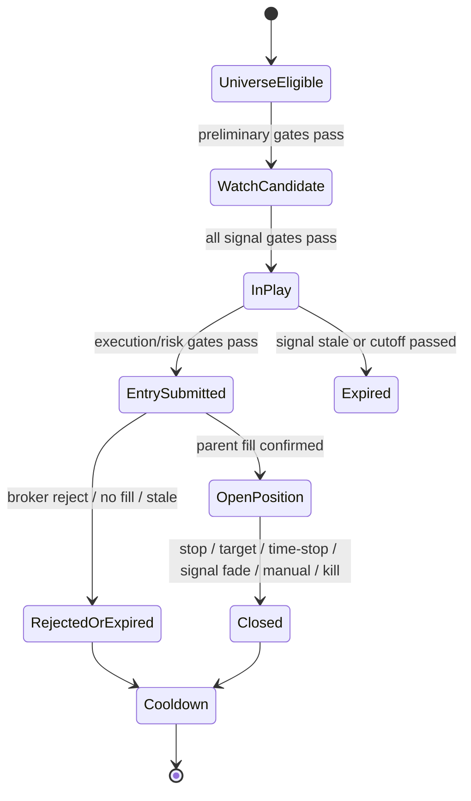
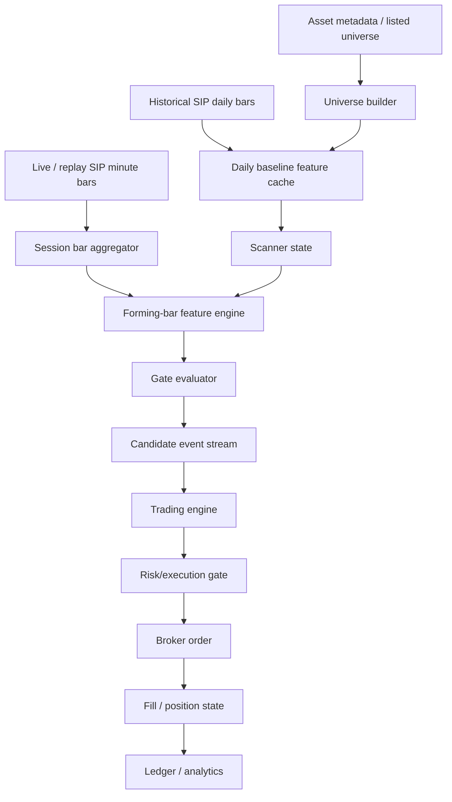

# Bowaka v2 Forming-Daily-Bar Strategy Handoff

**Audience:** Quant analyst, software engineer, strategy owner  
**Date:** 2026-05-18  
**Prepared from:** uploaded deep research report `deep-research-report.md` and uploaded implementation archive `bowaka_backup.zip`  
**Decision requested by strategy owner:** Table v1 and move directly to v2, aligning the implementation with the strongest current inference of Bowaka's actual process rather than incrementally extending a once-per-session entry model.

---

## 0. Executive summary

### 0.1 Decision

The current v1 implementation should be treated as a **control strategy / historical baseline only**, not as the target production design.

The target should become **Bowaka v2: a continuous all-day monitor of forming daily/session OHLCV conditions inside a filtered U.S. small-cap / low-liquidity universe**.

The core change is this:

| Version | Concept | Entry discovery | Strategic status |
|---|---|---|---|
| **v1 current** | Prior-day daily-bar screener, once-per-session execution | Candidate file built before the open; strategy runs one entry pass after the configured confirmation window | **Table as baseline/control only** |
| **v2 target** | Same Bowaka-like OHLCV filters, but evaluated against the **forming session bar** throughout the trading day | Scan/monitor the filtered universe all day; buy when a stock becomes “in play” intraday | **Primary implementation target** |

This change is justified because the research corpus does **not** imply that “daily strategy” must mean “buy once per day.” The stronger interpretation is:

> Bowaka may use daily/session-level OHLCV concepts, but monitor the forming daily bar throughout the day and execute when the abnormal-volume / daily-expansion / moving-average conditions become true.

That interpretation is reinforced by the secondary documentation inside the uploaded implementation archive, which states that Bowaka appears to scan the whole market, narrow it to a session-specific subset, and then apply more granular conditions, while the anomaly appears several times per day.

### 0.2 Strategy classification

**Strategy type:** Long-only, low-liquidity U.S. equity continuation / dislocation strategy.  
**Signal inputs:** OHLCV only for alpha features; quotes/spreads/halts used as execution and risk gates, not alpha features.  
**Core filters:** Volume/participation gate, daily/session expansion gate, moving-average/trend gate.  
**Execution style:** Time-sensitive long entry, likely market order or tightly controlled marketable limit; bracket exits off actual fill.  
**Holding period:** Very short horizon, likely 1–3 days.  
**Research status:** Plausible Bowaka-aligned hypothesis.  
**Deployment status:** **Research / paper trading only. Not live-ready.**

### 0.3 Bottom-line recommendation

Build v2 as a **same-day forming-bar scanner** with the following architecture:

```mermaid
flowchart LR
    A[Nightly / premarket universe builder] --> B[Eligible US common-stock universe]
    B --> C[Historical daily feature cache]
    C --> D[Prior ATR / prior volume / prior EMA baselines]
    B --> E[Intraday SIP minute-bar feed]
    E --> F[Forming daily/session OHLCV aggregator]
    D --> F
    F --> G[Volume gate: RVOL so far / projected RVOL]
    G --> H[Session expansion gate: range vs prior ATR]
    H --> I[Strong intraday close-location / price-control gate]
    I --> J[Moving-average trend gate]
    J --> K[Rank in-play candidates]
    K --> L[Execution-quality gate: spread, quote age, halt, ADV participation]
    L --> M[Market or marketable-limit buy]
    M --> N[Attach bracket from actual fill]
    N --> O[Stop / target / max-hold / signal-fade exits]
```



The existing v1 code already has several valuable pieces: universe filtering, daily features, instrument classification, fail-closed candidate validation, actual-fill bracket logic, ADV-tier participation caps, protected-position handling, kill switches, and ledgering. These should be reused. The main thing to replace is the **entry discovery model**.

---

## 1. Source basis and confidence

### 1.1 Uploaded deep research report: core claims to preserve

The uploaded deep research report says the highest-confidence read is that Bowaka is not doing order-book microstructure, market making, or tick-level HFT. Instead, his comments point to a **daily-bar, OHLCV-only, long-only strategy in low-liquidity U.S. equities** built from three gates: **volume**, **daily bar**, and **moving average**. See `deep-research-report.md`, lines 5–7.

The report infers short-horizon continuation after abnormal-volume expansion in small/illiquid stocks, filtered by a strong daily bar and short moving-average structure. See `deep-research-report.md`, lines 7–23 and lines 37–43.

The report also says Bowaka claims the anomaly occurs **several times a day**, that liquidity limits scaling, and that market impact differs materially between 10k and 100k trade sizes. See `deep-research-report.md`, lines 29–33.

The report's strongest rule-family inference is:

- U.S. small / lower-liquidity listed stocks.
- Price and minimum dollar-volume filters.
- Volume meaningfully above the stock's rolling baseline.
- Range or return abnormally large for that stock.
- Close strong in the upper part of the range.
- Price above a rising short moving average, or short EMA inflecting upward.
- Exit by fixed stop, fixed target, short max hold, and/or signal fade.

See `deep-research-report.md`, lines 66–89.

Important caveat from the report: Bowaka does **not** disclose exact exchange, price band, daily filter, moving-average formula, thresholds, or entry timing. See `deep-research-report.md`, lines 169–182.

### 1.2 Secondary docs inside the implementation archive: stronger v2 clue

The archive contains `scripts/documentation/original strategy/Inferring Bowaka#U2019s Tracking Logic from His Reddit History.md`. This document states that Bowaka appears to:

- scan the whole market rather than blindly buying low-volume names;
- apply a first filter for the ongoing session;
- then look for more granular conditions inside that pool;
- store daily/hourly data and fetch lower granularity only after a first filter;
- operate where the anomaly appears several times per day.

Key local references:

- `Inferring Bowaka#U2019s Tracking Logic from His Reddit History.md`, lines 30–41.
- The same file explicitly reconstructs a two-stage process: a market-wide prefilter followed by a granular entry test, and says the “several times a day” clue likely places the real-time entry inside that granular layer. See lines 49–51.

The archive also contains `scripts/documentation/original strategy/bowaka_strategy_implementation_review.md`, which states that the current implementation enters only once at the first session tick, and that this is simpler and safer but less faithful to the inferred architecture. See lines 493–504.

### 1.3 Confidence grading

| Claim | Confidence | Basis |
|---|---:|---|
| Bowaka uses OHLCV-only alpha inputs | High | Deep report and internal tracking doc agree. |
| Bowaka is long-only in live implementation | High | Deep report and internal tracking doc agree. |
| Bowaka uses three core gates: volume, daily/session, moving average | High | Repeated in report and tracking doc. |
| Bowaka trades low-liquidity / small-cap inefficiencies | High | Report and docs consistently point there. |
| Bowaka monitors the forming session all day | Medium-high | Not proven, but strongly suggested by “several times per day” and “first filter then granular conditions.” |
| Exact thresholds | Low | Not disclosed. Treat all values as test priors. |
| Exact entry timing | Low-medium | v2 is the stronger current inference, but timing must be validated. |
| Exact exit logic | Medium | Stop/target/short hold are plausible; signal fade should be tested. |

---

## 2. Current implementation inventory

This section identifies what the existing implementation already does, what should be reused, and what should be replaced.

### 2.1 Current files of interest

From `bowaka_backup.zip`:

| File | Purpose |
|---|---|
| `scripts/bowaka_prefilter.py` | Daily prefilter that computes Bowaka-like features from daily bars. |
| `scripts/bowaka_prefilter.yaml` | Daily prefilter configuration. |
| `scripts/bowaka_prefilter.cron` | Runs the prefilter before the session. |
| `scripts/bowaka_strategy.py` | Trading engine that loads candidates, sizes, enters, manages exits, ledgers, and handles risk controls. |
| `scripts/bowaka_strategy.yaml` | Strategy configuration. |
| `scripts/bowaka_counterfactuals.py` | Counterfactual / analysis support. |
| `scripts/bowaka_analysis.py` | Post-run analysis support. |
| `scripts/documentation/original strategy/*.md` | Prior strategy reviews and Bowaka inference docs. |

### 2.2 Existing signal logic is strongly Bowaka-like

`bowaka_prefilter.py` already computes the correct feature family:

| Feature | Current implementation | Local reference |
|---|---|---|
| Rolling average dollar volume | `avg_dollar_volume = rolling mean of close * volume, shifted one day` | `bowaka_prefilter.py`, lines 285–288 |
| Rolling average volume | `avg_volume = rolling mean of volume, shifted one day` | `bowaka_prefilter.py`, lines 289–291 |
| Relative volume | `rvol = volume / avg_volume` | `bowaka_prefilter.py`, line 292 |
| ATR percent | `atr_pct = atr / close` | `bowaka_prefilter.py`, lines 294–305 |
| Gap percent | `gap_pct = open / prev_close - 1` | `bowaka_prefilter.py`, line 306 |
| Range expansion | `(high - low) / atr` | `bowaka_prefilter.py`, line 307 |
| Close location | `(close - low) / (high - low)` | `bowaka_prefilter.py`, lines 309–310 |
| EMA distance | `close / ema - 1` | `bowaka_prefilter.py`, lines 312–313 |
| EMA slope | `ema / ema_lagged - 1` | `bowaka_prefilter.py`, lines 314–315 |

`bowaka_prefilter.py` also applies the correct gate family:

- price min/max;
- average dollar-volume min/max;
- RVOL min;
- ATR percent min;
- range-expansion min;
- close-location min;
- EMA-distance min;
- EMA-slope min;
- optional max RVOL / max range expansion / max gap;
- instrument classification and exclusion.

See `bowaka_prefilter.py`, lines 444–552.

This part should be **reused conceptually**, but not as a once-daily-only entry system.

### 2.3 Current prefilter is scheduled before the open

`bowaka_prefilter.cron` fires at 02:00 Mountain Time on weekdays, retrying at 03:00, 04:00, 05:00, and 06:00 Mountain Time. See `bowaka_prefilter.cron`, lines 4–10 and lines 37–42.

That means the current candidate set is pre-session / prior-day in practice. It is not discovering new same-day “in-play” names after 09:30 ET.

### 2.4 Current strategy executes one entry pass per session

The key current behavior:

- `run_session_entry_pass()` is described as “first tick of a new session.” See `bowaka_strategy.py`, lines 7460–7473.
- If intraday confirmation is enabled, the strategy waits until `window_minutes` has elapsed, then proceeds. See `bowaka_strategy.py`, lines 7489–7503.
- The main loop calls `run_session_entry_pass()` only when `state["session_date"] != today_iso`. See `bowaka_strategy.py`, lines 8828–8860.
- Subsequent ticks mostly poll fills, attach OCO brackets, enforce protected-position rules, log intraday ticks, manage liquidity/stop/time-stop/signal-fade/rescreens. See `bowaka_strategy.py`, lines 8861–8980.
- The YAML explicitly comments that `run_session_entry_pass` only fires once per session. See `bowaka_strategy.yaml`, lines 300–315.

That is the core mismatch with v2.

### 2.5 Current intraday confirmation is not intraday discovery

The current intraday confirmation layer is an execution-quality filter on prior-day candidates. It checks:

- spread;
- quote age;
- live price band relative to candidate close;
- optional opening-range/VWAP gates.

See `bowaka_strategy.yaml`, lines 284–370 and `bowaka_strategy.py`, lines 2283–2433.

That is useful, but it is not the same as scanning the forming daily bar all day for new signals.

### 2.6 Current post-closure rescreen is disabled

The YAML contains a post-closure rescreen facility but ships it disabled:

```yaml
entry:
  post_closure_rescreen:
    enabled: false
```

See `bowaka_strategy.yaml`, lines 372–383.

Even if enabled, this would still only redeploy into the existing candidate file after a closure. It would not create a same-day in-play universe from the forming session bar.

### 2.7 Current signal-fade exit is disabled

The YAML contains a signal-fade module but ships it disabled:

```yaml
exits:
  signal_fade:
    enabled: false
```

See `bowaka_strategy.yaml`, lines 403–420.

For v2, signal fade should be implemented and logged from the start. Whether it is active or telemetry-only during initial paper trading should be a deployment decision, but the architecture should include it.

### 2.8 Current data feed is not adequate for v2 validation

`bowaka_prefilter.yaml` uses Alpaca `iex` feed, while the YAML comment itself warns that IEX is partial-tape coverage and can distort RVOL / ADV / range expansion in microcaps. See `bowaka_prefilter.yaml`, lines 17–29.

For v2, SIP-quality consolidated minute and daily bars are required. The v2 signal lives or dies on volume, relative volume, range formation, and liquidity. A partial-tape feed can move names across threshold boundaries and invalidate the candidate ranking.

### 2.9 Current candidate schema omits `avg_volume`

The prefilter computes `avg_volume`, but the candidate output `feature_cols` currently includes:

```python
"close", "rvol", "atr_pct", "range_expansion", "gap_pct",
"close_location", "ema_distance", "ema_slope",
"avg_dollar_volume", "signal_strength"
```

It does not include `avg_volume`. See `bowaka_prefilter.py`, lines 573–640.

The strategy’s opening-range confirmation expects `avg_volume` from `entry.candidate.features`. See `bowaka_strategy.py`, lines 2378–2384. But `load_candidates()` only hydrates feature keys including `avg_dollar_volume`, not `avg_volume`. See `bowaka_strategy.py`, lines 869–873.

For v2, `avg_volume`, volume-curve baselines, and prior opening-window volume baselines must be first-class fields.

---

## 3. Why v1 should be tabled

### 3.1 v1 is a different strategy variant

v1 is best described as:

> Prior-day daily candidate file + one delayed session-entry pass + position management.

v2 is best described as:

> Same OHLCV feature family, but evaluated against the forming daily/session bar all day, with entries triggered when the stock becomes in play intraday.

Both can be “daily OHLCV strategies.” They are not the same strategy.

### 3.2 v1 misses same-day regime transitions

The most important missed events are:

| Event | v1 current behavior | v2 target behavior |
|---|---|---|
| Stock becomes in play at 10:45 ET | Missed unless already in prior candidate file | Detected by forming-bar scanner |
| Volume explodes midday | Missed for new entries | Detected by RVOL-so-far / projected RVOL |
| Range expansion forms after lunch | Missed for new entries | Detected by current session range vs prior ATR |
| Stock holds near session high at 14:00 | Missed unless prior-day candidate | Detected by close-location-so-far |
| Signal appears several times per day in different names | Current one-shot entry pass cannot discover them | Scanner can rank and trade them subject to risk caps |
| Prior-day candidate gaps/fails | May reject on quote gate but does not replace with fresher signal | Fresh same-day candidates compete for capital |

### 3.3 v1 is still useful as a baseline

Do not delete v1. Keep it as:

- a backtest/control strategy;
- a regression baseline;
- a comparison against v2 entry discovery;
- a way to determine whether same-day discovery genuinely improves expectancy or only increases turnover/costs.

But do not spend further engineering effort optimizing v1 as the primary path unless v2 fails validation.

---

## 4. v2 strategy hypothesis

### 4.1 One-sentence target

Bowaka v2 should scan the filtered U.S. equity universe all day for small / tradably illiquid names whose **forming session OHLCV bar** shows abnormal participation, abnormal expansion, strong price control, and short moving-average alignment, then enter quickly with bounded market-impact risk and exit over a short continuation window.

### 4.2 What “daily strategy” means in v2

In v2, “daily” means:

- the core bar being evaluated is the **session/day bar**;
- the baseline features are daily: prior ATR, prior average volume, prior ADV, prior EMA;
- the forming session bar is updated from intraday minute bars;
- no order-book imbalance, Level II, tick-to-tick spoofing, or microstructure alpha is required.

It does **not** mean:

- signals are computed only after the close;
- entries happen only once per day;
- all candidates must come from yesterday’s completed bar.

### 4.3 The three Bowaka-like gates in v2

The v2 strategy should preserve the three-gate structure, but express it in causal same-day terms.

#### Gate 1: Volume / participation gate

Purpose: detect that the stock is truly “in play” and not just drifting on negligible liquidity.

Recommended features:

```text
avg_volume_20d             = mean(completed_daily_volume[-20:])
avg_dollar_volume_20d      = mean(completed_daily_close * completed_daily_volume over prior 20 days)
current_session_volume_t   = cumulative volume from session open through scan time t
volume_curve_fraction_t    = expected fraction of full-day volume observed by scan time t
expected_volume_until_t    = avg_volume_20d * volume_curve_fraction_t
rvol_so_far_t              = current_session_volume_t / expected_volume_until_t
projected_full_day_rvol_t  = (current_session_volume_t / volume_curve_fraction_t) / avg_volume_20d
```

Use a **time-of-day volume curve**. A stock with 1.2x full-day volume by 10:00 ET is very different from a stock with 1.2x full-day volume by 15:45 ET.

Minimum implementation:

- compute a market-wide or ADV-bucket volume curve;
- later upgrade to symbol-level curves if data supports it;
- fail closed if current volume or historical volume is missing.

Initial research priors:

| Parameter | Initial value | Notes |
|---|---:|---|
| `rvol_so_far_min` | `1.50` | Same spirit as v1 RVOL threshold. |
| `projected_full_day_rvol_min` | `1.50` | Useful when volume curve is calibrated. |
| `opening_volume_rvol_min` | `1.25` | Applies during first 15–30 minutes if using opening range. |
| `avg_dollar_volume_min` | `250000` | Research prior from report; v1 uses 200k in current YAML. |

#### Gate 2: Daily/session expansion gate

Purpose: detect that the day has become abnormal for this stock.

Recommended features:

```text
prior_atr_14d              = mean(true_range over prior 14 completed sessions)
prior_atr_pct              = prior_atr_14d / prior_close
session_range_t            = session_high_t - session_low_t
range_expansion_so_far_t   = session_range_t / prior_atr_14d
current_return_t           = last_price_t / prior_close - 1
gap_pct                    = session_open / prior_close - 1
```

Critical lookahead rule:

> For same-day scanning, ATR must be computed from **prior completed sessions only**. Do not include the current session’s true range in the ATR denominator.

The implementation review in the archive explicitly notes this issue: for a same-session scanner, compare today’s range against prior ATR rather than a rolling ATR that includes the move being detected. See `bowaka_strategy_implementation_review.md`, lines 480–489.

Initial research priors:

| Parameter | Initial value | Notes |
|---|---:|---|
| `prior_atr_pct_min` | `0.06` | Keeps high-volatility names. |
| `range_expansion_so_far_min` | `1.25` | Session range must exceed normal range. |
| `gap_pct_max` | `0.25` | Research; avoid exhausted gap blow-offs until validated. |
| `range_expansion_so_far_max` | `2.50` | Research; optional blow-off cap. |

#### Gate 3: Moving-average trend gate

Purpose: require directional alignment so the scanner does not buy random high-volume churn or a downtrend bounce.

Recommended features:

```text
ema_10_prior               = EMA of prior completed daily closes
ema_10_lag_3               = EMA value 3 completed sessions ago
ema_slope_prior            = ema_10_prior / ema_10_lag_3 - 1
ema_distance_t             = last_price_t / ema_10_prior - 1
ema_10_forming_t_optional  = alpha * last_price_t + (1 - alpha) * ema_10_prior
```

Recommended gate:

```text
ema_distance_t >= 0
ema_slope_prior >= 0
```

Optional research variant:

```text
ema_10_forming_t > ema_10_prior
```

Do not overcomplicate this. The public clues indicate simple threshold logic, not a complex predictive model.

### 4.4 Strong-close / price-control gate for forming bars

The completed-daily strategy uses close location. v2 should translate that into **current last price relative to the current session range**.

```text
close_location_so_far_t = (last_price_t - session_low_t) / (session_high_t - session_low_t)
```

Gate:

```text
close_location_so_far_t >= 0.60
```

This does not require waiting until the close. It asks whether buyers are controlling the forming session bar at the current scan time.

### 4.5 Candidate score

The v2 score should be bounded by default. The current v1 score is unbounded when `score.bounded: false`, which allows extreme RVOL to dominate ranking. For v2, use a bounded score so blow-off names do not overwhelm the slate.

Recommended initial score:

```text
score =
    1.00 * min(rvol_so_far_t, 5.0)
  + 1.00 * min(range_expansion_so_far_t, 2.5)
  + 0.75 * close_location_so_far_t
  + 10.0 * clip(ema_distance_t, 0.0, 0.40)
  + 10.0 * clip(ema_slope_prior, 0.0, 0.25)
  - 1.00 * max(gap_pct - 0.25, 0.0)
```

This is a research prior, not a final optimized model. The quant analyst should run ablations and sensitivity analysis rather than optimize it blindly.

### 4.6 Candidate state machine

A symbol should move through these states:



Important state rules:

- A symbol should generally be entered **at most once per session**.
- A symbol may remain watchlisted after preliminary gates pass but should not be traded unless all entry gates pass.
- Signals should expire if not acted on within a configured time window.
- A signal should be invalidated if price loses the prior close, falls below VWAP, loses the EMA gate, or quote/spread/halts become unacceptable.
- Entry should be blocked if the position would exceed ADV participation caps or daily risk limits.

---

## 5. v2 engineering architecture

### 5.1 Recommended module layout

The cleanest engineering path is to split v2 into explicit components:

| Component | New or existing | Responsibility |
|---|---|---|
| `bowaka_universe_builder.py` | New or refactor from prefilter | Nightly universe snapshot, asset metadata, instrument exclusions, daily feature cache. |
| `bowaka_intraday_scanner.py` | New | Builds forming session bars, computes v2 features, emits in-play candidate events. |
| `bowaka_strategy.py` | Existing, modified | Consumes candidate events, applies risk/execution gates, submits entries, manages exits. |
| `bowaka_v2_features.py` | New | Shared feature functions for backtest, scanner, and signal fade. |
| `bowaka_v2_config.yaml` | New | v2-specific configuration. |
| `bowaka_v2_backtest.py` | New or refactor | Intraday forward simulator using the same feature functions. |
| `bowaka_v2_analysis.py` | New or refactor | Produces validation reports, bucket analysis, paper-vs-sim reconciliation. |

Do not bury v2 inside the existing prefilter without a clear mode switch. The entry discovery model is materially different.

### 5.2 Runtime architecture options

#### Option A: Single process

The strategy process both scans and trades.

Pros:

- simpler deployment;
- less IPC complexity;
- easier state consistency.

Cons:

- scanner latency and broker latency are coupled;
- failure in scanner can impact position management;
- harder to backfill candidate events independently.

#### Option B: Scanner process + trading process

A scanner emits `candidate_event` JSONL or queue messages; the strategy consumes them.

Pros:

- cleaner separation of alpha discovery and execution;
- easier to replay scanner events;
- easier to validate v2 scanner offline;
- strategy can continue position management if scanner fails.

Cons:

- needs event schema, queue/dedup logic, and heartbeat monitoring.

Recommended path: **Option B** for production-minded engineering, with a temporary single-process mode allowed for local paper tests.

### 5.3 Data flow



### 5.4 Candidate event schema v3

The existing candidate schema should become a v3 event schema for v2. Every candidate event must be replayable and auditable.

```json
{
  "schema_version": 3,
  "strategy": "bowaka_v2",
  "event_type": "candidate_signal",
  "event_id": "bowaka_v2:2026-05-18:XYZ:2026-05-18T14:35:00Z",
  "generated_at": "2026-05-18T14:35:02Z",
  "session_date": "2026-05-18",
  "scan_timestamp": "2026-05-18T14:35:00Z",
  "provider": "alpaca",
  "data_feed": "sip",
  "bar_interval": "1m",
  "config_hash": "sha256:<full_hash>",
  "universe_hash": "sha256:<full_hash>",
  "symbol": "XYZ",
  "exchange": "NASDAQ",
  "venue_code": "XNAS",
  "instrument_class": "operating_equity",
  "eligible_for_bowaka_equity_bucket": true,
  "prior_daily_baselines": {
    "prior_close": 7.42,
    "avg_volume_20d": 450000,
    "avg_dollar_volume_20d": 3100000,
    "prior_atr_14d": 0.52,
    "prior_atr_pct": 0.0701,
    "ema_10_prior": 7.18,
    "ema_10_lag_3": 7.04,
    "ema_slope_prior": 0.0199
  },
  "forming_session_bar": {
    "session_open": 7.61,
    "session_high": 8.20,
    "session_low": 7.50,
    "last_price": 8.11,
    "session_volume": 820000,
    "session_range": 0.70,
    "last_bar_timestamp": "2026-05-18T14:34:00Z"
  },
  "intraday_volume_context": {
    "volume_curve_fraction": 0.42,
    "expected_volume_until_scan": 189000,
    "rvol_so_far": 4.34,
    "projected_full_day_rvol": 4.34
  },
  "features": {
    "gap_pct": 0.0256,
    "current_return_pct": 0.1482,
    "range_expansion_so_far": 1.346,
    "close_location_so_far": 0.871,
    "ema_distance": 0.128,
    "ema_slope": 0.0199,
    "signal_strength": 7.82
  },
  "gate_results": {
    "price_gate": true,
    "avg_dollar_volume_gate": true,
    "rvol_gate": true,
    "prior_atr_pct_gate": true,
    "range_expansion_gate": true,
    "close_location_gate": true,
    "ema_distance_gate": true,
    "ema_slope_gate": true,
    "max_gap_gate": true,
    "instrument_gate": true
  },
  "candidate_rank": 1,
  "signal_expiry_timestamp": "2026-05-18T14:45:00Z"
}
```

Required additions relative to v1:

- `scan_timestamp`;
- `session_date`;
- current forming session OHLCV;
- `avg_volume_20d`;
- time-of-day volume curve fields;
- prior ATR and prior EMA fields;
- complete gate results;
- signal expiry;
- v2 config hash and universe hash.

### 5.5 Entry decision schema

Every accepted and rejected candidate should produce an `entry_decision` event.

```json
{
  "schema_version": 3,
  "strategy": "bowaka_v2",
  "event_type": "entry_decision",
  "decision": "accepted",
  "reason": "all_gates_passed",
  "event_id": "bowaka_v2:2026-05-18:XYZ:entry:2026-05-18T14:35:05Z",
  "candidate_event_id": "bowaka_v2:2026-05-18:XYZ:2026-05-18T14:35:00Z",
  "session_date": "2026-05-18",
  "symbol": "XYZ",
  "entry_trigger": "forming_daily_bar_scan",
  "scan_timestamp": "2026-05-18T14:35:00Z",
  "decision_timestamp": "2026-05-18T14:35:05Z",
  "quote": {
    "bid": 8.10,
    "ask": 8.14,
    "mid": 8.12,
    "spread_pct": 0.0049,
    "quote_timestamp": "2026-05-18T14:35:04Z",
    "quote_age_seconds": 1
  },
  "risk_snapshot": {
    "bankroll": 90000,
    "gross_exposure_dollars": 32000,
    "gross_exposure_pct": 0.356,
    "entries_today": 4,
    "open_positions": 8,
    "candidate_adv": 3100000,
    "target_notional": 4000,
    "adv_participation_frac": 0.00129
  },
  "order_plan": {
    "side": "buy",
    "order_style": "market",
    "qty": 492,
    "estimated_notional": 3995.04,
    "stop_pct": 0.08,
    "target_pct": 0.15,
    "max_hold_days": 3
  }
}
```

Rejected decisions must be equally detailed. Canonical rejection reasons should include:

- `data_feed_mismatch`;
- `stale_bar`;
- `missing_daily_baseline`;
- `instrument_ineligible`;
- `halt_or_pending_review`;
- `same_symbol_already_entered_today`;
- `symbol_cooldown`;
- `daily_entry_cap`;
- `max_concurrent_positions`;
- `gross_exposure_cap`;
- `adv_cap`;
- `spread_too_wide`;
- `quote_stale`;
- `price_chase_band`;
- `lost_signal_before_entry`;
- `past_last_entry_time`;
- `kill_switch`;
- `broker_reject`.

### 5.6 Main loop pseudocode

```python
def main_loop_v2(now):
    load_config()
    assert config.strategy.mode == "forming_daily_bar_monitor"
    assert config.data.feed == "sip" or config.data.allow_non_sip_for_research_only

    state = load_state()
    universe = load_universe_snapshot()
    daily_baselines = load_daily_feature_cache()

    while session_is_open(now):
        check_kill_switches()
        reconcile_orders_and_positions()
        manage_existing_positions()

        if not scanner_window_open(now):
            sleep(loop_interval)
            continue

        if scanner_due(now):
            bars = fetch_or_update_intraday_bars(universe, now)
            session_features = compute_forming_session_features(
                bars=bars,
                daily_baselines=daily_baselines,
                volume_curve=volume_curve,
                now=now,
            )
            candidates = apply_v2_gates(session_features, config)
            ranked = rank_candidates(candidates, config)
            emit_candidate_events(ranked)

            for candidate in ranked:
                if not risk_allows_candidate(candidate, state, config):
                    emit_rejection(candidate, reason)
                    continue
                if not execution_quality_allows(candidate, now, config):
                    emit_rejection(candidate, reason)
                    continue
                submit_entry(candidate)
                mark_symbol_entered_or_pending(candidate.symbol)
                if reached_scan_entry_budget():
                    break

        sleep(loop_interval)
```

### 5.7 Avoiding lookahead in v2

The feature engine must obey these rules:

| Feature | Must use | Must not use |
|---|---|---|
| Prior ATR | Completed sessions before today | Current session range in ATR denominator |
| Prior average volume | Completed sessions before today | Today’s full-day volume |
| Volume curve | Historical intraday bars before today | Future same-day volume |
| EMA baseline | Completed sessions before today | Today’s close unless using explicitly causal forming EMA |
| Close location | Last observed price at scan time | End-of-day close after scan time |
| Range expansion | Current session high/low up to scan time | Future high/low after scan time |
| Candidate ranking | Features available at scan time | Later realized PnL, later close, later volume |

This should be enforced in unit tests and backtest replay.

---

## 6. Recommended v2 configuration

This YAML is a **research/paper-trading starting point**, not a live deployment config.

```yaml
strategy:
  name: "BowakaV2"
  strategy_id: "bowaka_v2"
  mode: "forming_daily_bar_monitor"
  environment: "paper"
  analysis_epoch: "bowaka_v2_research_epoch_2026_05_18"

paths:
  universe_snapshot_path: "data/bowaka_v2/universe_snapshot.json"
  daily_feature_cache_path: "data/bowaka_v2/daily_feature_cache.parquet"
  volume_curve_path: "data/bowaka_v2/volume_curve.parquet"
  candidate_events_path: "data/bowaka_v2/candidate_events.jsonl"
  entry_decisions_path: "data/bowaka_v2/entry_decisions.jsonl"
  state_path: "data/bowaka_v2/state.json"
  trade_ledger_path: "data/bowaka_v2/trade_ledger.jsonl"
  daily_summary_path: "data/bowaka_v2/daily_summary.jsonl"
  log_path: "logs/bowaka_v2_strategy.log"
  kill_switch_dir: "."

data:
  provider: "alpaca"
  feed: "sip"
  allow_non_sip_for_research_only: false
  daily_timeframe: "1D"
  intraday_timeframe: "1m"
  timezone: "America/New_York"
  min_history_trading_days: 45
  require_adjusted_daily_bars: true
  require_split_adjustment: true
  fail_on_missing_baseline: true
  max_bar_age_seconds: 90
  max_quote_age_seconds: 15

session:
  timezone: "America/New_York"
  start: "09:30"
  end: "15:55"
  scanner_start: "09:45"
  scanner_end: "15:30"
  loop_interval_seconds: 5

universe:
  allowed_exchanges: ["NASDAQ", "NYSE", "AMEX", "ARCA", "BATS"]
  exclude_otc: true
  exclude_etf: true
  exclude_leveraged_etp: true
  exclude_inverse_etp: true
  exclude_etn: true
  exclude_warrants: true
  exclude_units: true
  exclude_rights: true
  exclude_preferred: true
  ticker_blocklist: ["TSLL", "CONL", "SMCX"]

  price_min: 1.0
  price_max: 20.0
  avg_dollar_volume_min: 250000
  avg_dollar_volume_max: null

  # Optional metadata enrichments for research buckets, not required alpha gates.
  market_cap_max: null
  float_shares_max: null
  shares_outstanding_max: null

historical_features:
  lookback_days: 20
  atr_days: 14
  ema_days: 10
  ema_slope_lookback: 3
  volume_curve:
    mode: "adv_bucket"       # adv_bucket | symbol | market_default
    bucket_edges: [250000, 500000, 1000000, 5000000, 20000000]
    fallback_opening_15m_share: 0.08
    min_days_for_symbol_curve: 20

scanner:
  enabled: true
  scan_interval_seconds: 60
  full_universe_refresh_interval_minutes: 5
  in_play_refresh_interval_seconds: 60
  max_candidates_per_scan: 25
  max_entries_per_scan: 3
  signal_expiry_seconds: 600
  same_symbol_entries_per_day: 1
  symbol_cooldown_minutes: 390
  require_prior_daily_baseline: true
  require_fresh_intraday_bar: true

signals:
  rvol_so_far_min: 1.50
  projected_full_day_rvol_min: 1.50
  prior_atr_pct_min: 0.06
  range_expansion_so_far_min: 1.25
  close_location_so_far_min: 0.60
  ema_distance_min: 0.0
  ema_slope_min: 0.0

  # Blow-off / exhaustion guards. Research priors; tune only out-of-sample.
  rvol_so_far_max: 8.0
  projected_full_day_rvol_max: 8.0
  range_expansion_so_far_max: 2.50
  gap_pct_max: 0.25
  current_return_pct_max: 0.50

score:
  bounded: true
  rvol_score_cap: 5.0
  range_score_cap: 2.5
  ema_distance_score_cap: 0.40
  ema_slope_score_cap: 0.25
  close_location_weight: 0.75
  gap_penalty_above: 0.25

execution:
  parent_order_style: "market"       # market for Bowaka fidelity; marketable_limit for safety variant
  marketable_limit_slippage_pct: 0.005
  marketable_limit_timeout_seconds: 30
  bracket_pricing_mode: "actual_fill"
  default_venue_code: "XNAS"

  quote_gate:
    enabled: true
    max_spread_pct: 0.01
    max_quote_age_seconds: 15
    require_bid_ask_positive: true

  price_chase_gate:
    enabled: true
    max_pct_above_signal_price: 0.10
    min_pct_below_signal_price: -0.03

  halt_gate:
    enabled: true
    block_on_halt_or_pending_review: true
    block_on_recent_luld_pause: true

sizing:
  sizing_mode: "equal_slice"          # equal_slice | risk_per_trade
  bankroll_fixed_dollars: 90000
  max_concurrent_positions: 18
  equal_slice_bankroll_fraction: 0.80
  target_risk_dollars: 200
  min_order_notional: 500
  max_per_trade_dollars: null

risk:
  daily_loss_pct: 0.03
  strategy_slice_loss_pct: 0.025
  max_gross_exposure_pct: 0.80
  max_total_entries_per_day: 10
  max_stopouts_per_day: 2
  stop_trading_after_consecutive_stopouts: 2

  adv_tier_caps:
    - max_adv_dollars: 250000
      reject_if_below: true
    - max_adv_dollars: 500000
      max_position_as_adv_frac: 0.003
    - max_adv_dollars: 1000000
      max_position_as_adv_frac: 0.005
    - max_adv_dollars: 5000000
      max_position_as_adv_frac: 0.010
    - max_adv_dollars: null
      max_position_as_adv_frac: 0.015

exits:
  stop_pct: 0.08
  target_pct: 0.15
  max_hold_days: 3

  time_stop:
    enabled: true
    exit_time: "15:45"

  signal_fade:
    enabled: true
    initial_mode: "telemetry_then_active_after_validation"
    eval_time: "15:45"
    telemetry_time: "16:05"
    score_thresholds:
      soft: 0.34
      hard: 0.50
      critical: 0.67
    exit_on: ["hard", "critical"]
    order_style: "marketable_limit"
    marketable_limit_offset_pct: 0.005

protected_position:
  enabled: true
  max_unprotected_seconds: 10
  max_oco_attach_attempts: 2
  fallback_stop_enabled: true
  flatten_if_unprotected: true
  block_entries_on_violation: true

logging:
  emit_candidate_events: true
  emit_entry_decisions: true
  emit_rejected_candidates: true
  emit_feature_snapshots: true
  intraday_tick_interval_seconds: 60
  persist_config_snapshot: true
```

Notes:

1. `feed: "sip"` is intentionally strict. IEX may be useful for plumbing tests only, not signal validation.
2. `parent_order_style: "market"` is Bowaka-faithful. A marketable-limit variant should be tested side by side.
3. Signal fade is included architecturally. During initial paper validation, it can be telemetry-first, but the v2 system must collect the data from day one.
4. The ADV caps are intentionally conservative because the edge is capacity-limited.

---

## 7. Required implementation changes

### 7.1 P0 changes — required before v2 paper trading

#### P0.1 Build a v2 scanner instead of extending the once-daily entry pass

Do not rely on `run_session_entry_pass()` as the v2 entry-discovery engine. That function is structurally built around first-session-tick semantics and `state.session_date` dedupe.

Required change:

```yaml
strategy:
  mode: "forming_daily_bar_monitor"
```

Then branch the main loop:

```python
if cfg["strategy"].get("mode") == "prior_day_candidates":
    run_v1_session_entry_model(...)
elif cfg["strategy"].get("mode") == "forming_daily_bar_monitor":
    run_v2_scanner_and_entry_model(...)
else:
    fail_closed()
```

#### P0.2 Replace daily candidate file with event stream

v1 candidate file:

```text
data/in_play_candidates.json
```

v2 should use:

```text
data/bowaka_v2/candidate_events.jsonl
```

Candidate events are time-stamped, replayable, and can contain multiple signals per day.

#### P0.3 Use SIP consolidated data

`bowaka_prefilter.yaml` currently uses `feed: "iex"`. For v2 signal validation, this should fail closed unless explicitly running a plumbing-only test.

Implementation gate:

```python
if cfg["data"]["feed"] != "sip" and not cfg["data"].get("allow_non_sip_for_research_only"):
    raise ConfigError("Bowaka v2 requires SIP-quality consolidated bars")
```

#### P0.4 Compute prior ATR causally

Create a shared feature function:

```python
def compute_prior_daily_baselines(daily_bars):
    # daily_bars must end at the prior completed session.
    tr = max(
        high - low,
        abs(high - prev_close),
        abs(low - prev_close),
    )
    prior_atr_14d = rolling_mean(tr, 14)
    avg_volume_20d = rolling_mean(volume, 20)
    avg_dollar_volume_20d = rolling_mean(close * volume, 20)
    ema_10_prior = ewm(close, span=10)
    ema_slope_prior = ema_10_prior / ema_10_prior.shift(3) - 1
```

Do not include today’s current range in `prior_atr_14d`.

#### P0.5 Add `avg_volume` and volume-curve fields

Existing candidate output omits `avg_volume`, but v2 requires it. Add:

- `avg_volume_20d`;
- `avg_dollar_volume_20d`;
- `volume_curve_fraction`;
- `expected_volume_until_scan`;
- `rvol_so_far`;
- `projected_full_day_rvol`;
- optionally `opening_volume_rvol`.

#### P0.6 Implement same-day scanner state

Add to state:

```json
{
  "session_date": "2026-05-18",
  "entered_symbols_today": ["XYZ"],
  "rejected_symbols_today": {
    "ABC": {"reason": "spread_too_wide", "last_ts": "..."}
  },
  "cooldowns": {
    "XYZ": {"until": "2026-05-19T13:30:00Z", "reason": "entered_today"}
  },
  "in_play_pool": {
    "XYZ": {
      "last_signal_ts": "2026-05-18T14:35:00Z",
      "signal_expiry_ts": "2026-05-18T14:45:00Z",
      "last_signal_strength": 7.82
    }
  },
  "scanner_last_run_ts": "2026-05-18T14:35:00Z"
}
```

#### P0.7 Preserve actual-fill bracket behavior

The current `bracket_pricing_mode: "actual_fill"` is correct. Keep it. Do not revert to candidate-close bracket pricing.

#### P0.8 Wire halt detection into runtime entry blocking

The current strategy has some halt scaffolding, but v2 microcap trading requires explicit block behavior:

- no new entries if symbol halted, held, pending review, or in LULD pause;
- if broker rejects due to halt, mark symbol cooldown for the session;
- do not repeatedly resubmit halted names;
- do not mark exit completed unless sell order status confirms fill.

### 7.2 P1 changes — required before serious backtesting

#### P1.1 Build an intraday replay backtester

A valid v2 backtest must replay minute bars sequentially and only expose data available at each scan time.

Backtest loop:

```python
for session in sessions:
    load_prior_daily_baselines(session - 1)
    for t in scan_times(session):
        update_session_bars_through(t)
        compute_v2_features_through(t)
        generate_candidates()
        simulate_entry_orders()
        simulate_exits_and_marks()
```

#### P1.2 Use historical universe with delisted names

A survivorship-biased current universe will overstate performance. Required datasets:

- historical listed common-stock universe;
- delisted names;
- corporate actions;
- split-adjusted and raw price/volume handling;
- halted/suspended symbols;
- listing exchange history if possible.

#### P1.3 Add transaction-cost model

At minimum:

```text
entry_price = ask_or_next_bar_open + slippage
exit_price = bid_or_next_bar_open - slippage
slippage = f(order_notional / ADV, spread_pct, volatility, time_of_day)
```

Stress-test at trade sizes:

- $1k;
- $5k;
- $10k;
- $25k;
- $50k;
- $100k.

The deep report specifically warns that scaling and market impact are central to the thesis.

#### P1.4 Implement v2 feature parity tests

The same feature code must be used by:

- scanner;
- backtester;
- signal fade;
- analysis notebooks.

No duplicate formula drift.

### 7.3 P2 changes — production hardening after paper validation

- Add streaming minute-bar ingestion rather than polling all symbols every scan.
- Add queue or append-only event stream between scanner and trader.
- Add data heartbeat monitor.
- Add broker heartbeat monitor.
- Add operator dashboard for candidates, accepted/rejected entries, open positions, exposure, and kill switches.
- Add schema versioning for all event streams.
- Add replay tool that reconstructs every decision from raw bars and config hash.

---

## 8. Quant validation plan

### 8.1 Validation objective

The goal is not to show a beautiful equity curve. The goal is to determine whether v2 has **robust net expectancy after realistic costs**, and whether that expectancy is attributable to the Bowaka-like signal family rather than lookahead, survivorship bias, liquidity underestimation, data-feed artifacts, or overfitting.

### 8.2 Required datasets

| Dataset | Required for | Notes |
|---|---|---|
| SIP daily OHLCV | Prior baselines | Must handle splits/corporate actions correctly. |
| SIP minute OHLCV | Forming session scanner | Needed for volume curve and causal intraday features. |
| Historical universe with delistings | Survivorship control | Current live universe alone is invalid for inference. |
| Corporate actions | Split/price adjustment | Reverse splits and low-float names are common in target regime. |
| Halt / LULD data | Operational realism | Microcaps can halt exactly when signals fire. |
| Quotes or spread proxies | Execution costs | At least model spread by symbol/time/ADV bucket. |
| Broker paper fills | Paper-vs-sim reconciliation | Needed before live. |

### 8.3 Data-quality checks

Before modeling:

1. Verify timezone handling: all bars aligned to U.S. regular trading session.
2. Verify regular-hours vs extended-hours inclusion. v2 should start with regular-hours only unless premarket is explicitly modeled.
3. Check missing minute bars by symbol and session.
4. Check zero-volume bars.
5. Check split adjustment consistency between daily and minute bars.
6. Check duplicate bars.
7. Check out-of-order bars.
8. Check stale bars during live polling.
9. Check volume conservation: sum of minute volume should reconcile to daily volume within vendor tolerance.
10. Compare IEX vs SIP feature drift for a sample to quantify why IEX is unacceptable for final validation.

### 8.4 Backtest variants

The quant analyst should run these variants:

| Variant | Purpose |
|---|---|
| **v1 prior-day open-entry** | Current baseline/control. |
| **v2 all-day scanner** | Target design. |
| **v2 opening-only 09:45** | Tests whether most edge is near open. |
| **v2 morning-only 09:45–11:00** | Tests early-session concentration. |
| **v2 midday 11:00–14:00** | Tests whether later signals are lower quality. |
| **v2 late-day 14:00–15:30** | Tests close-location / end-of-day continuation. |
| **v2 close-entry only** | Tests whether waiting for nearly complete daily bar helps. |
| **v2 market order vs marketable-limit** | Tests Bowaka fidelity vs execution safety. |
| **v2 with active signal fade vs telemetry-only** | Tests exit logic. |

### 8.5 Ablation tests

Run at least:

| Ablation | What it tests |
|---|---|
| Remove volume gate | Whether participation signal is actually carrying edge. |
| Remove range expansion | Whether pure RVOL + MA is enough. |
| Remove close-location | Whether price control matters. |
| Remove EMA slope | Whether trend filter matters. |
| Remove EMA distance | Whether price/MA alignment matters. |
| Remove gap cap | Whether blow-offs contaminate results. |
| Remove ADV cap | Whether profits are untradeable capacity artifacts. |
| Randomize entry among candidates | Whether ranking has predictive value. |
| Shuffle signal timestamps within day | Detects time-of-day artifacts. |
| Delay entry by 1/5/15/30 minutes | Tests timing decay. |

### 8.6 Bucket analysis

Report expectancy by:

- ADV bucket: $250k–$500k, $500k–$1M, $1M–$5M, $5M–$20M, >$20M;
- price bucket: $1–$2, $2–$5, $5–$10, $10–$20;
- spread bucket;
- RVOL bucket;
- range-expansion bucket;
- close-location bucket;
- time-of-day bucket;
- day-of-week bucket;
- market regime;
- sector / industry;
- catalyst tag where available;
- halt-prone vs non-halt-prone names;
- profitable vs unprofitable periods.

### 8.7 Out-of-sample design

Do not tune on the final test period.

Recommended design:

```text
Train/calibration window:     2016–2019
Validation window:            2020–2022
Final holdout:                2023–2026
```

Also run rolling walk-forward:

```text
Calibrate on 24 months -> test next 3 months -> roll forward.
```

Thresholds should be selected for stability, not maximum Sharpe.

### 8.8 Cost and capacity validation

Required cost stress levels:

| Stress | Description |
|---|---|
| Base | Half-spread + modest impact. |
| Conservative | Full spread + impact by ADV fraction. |
| Severe | Full spread + 2x impact + adverse exit slippage. |
| Halt stress | Cannot exit until next available print after halt. |
| Gap stress | Overnight stop fills worse than stop level. |

Capacity should be reported as a curve, not a single number:

```text
Expected net return vs order_notional:
$1k, $5k, $10k, $25k, $50k, $100k
```

The v2 strategy should not be considered validated if its profitability only exists at unrealistic fill assumptions or after ignoring capacity.

### 8.9 Acceptance criteria for paper trading

Minimum bar for controlled paper trading:

1. No lookahead in feature engine demonstrated by unit tests.
2. SIP minute/daily data available and reconciled.
3. Historical v2 backtest positive net expectancy after conservative costs.
4. Performance not driven by top 1% of trades only.
5. Results survive at least 2 of 3 major subperiods.
6. ADV/spread bucket analysis identifies where the edge is tradable.
7. Entry delay sensitivity shows edge does not vanish under realistic latency.
8. Paper execution logs every candidate, rejection, order, fill, and bracket attach.
9. Protected-position logic blocks new entries if a prior position is unprotected.
10. Kill switches tested.

### 8.10 Acceptance criteria for live consideration

Minimum bar before even considering small live capital:

1. 30–60 trading days of paper trading with v2 scanner.
2. Paper-vs-sim slippage reconciliation within predefined tolerance.
3. No unresolved broker reconciliation errors.
4. No unprotected positions beyond threshold.
5. Daily loss controls active, not disabled.
6. Gross exposure cap active.
7. ADV participation cap active.
8. Halt handling tested.
9. Signal fade / time-stop behavior validated.
10. Config/data hashes pinned.
11. Operator runbook completed.
12. Final live readiness review signed off by quant and engineer.

Even after passing these, classify as **candidate live deployment**, not proven production strategy.

---

## 9. Engineering test plan

### 9.1 Unit tests

| Test | Requirement |
|---|---|
| `test_prior_atr_excludes_current_session` | Current session bars must not affect prior ATR. |
| `test_avg_volume_excludes_current_session` | Same-day volume must not affect average volume baseline. |
| `test_volume_curve_causal` | Volume curve must be built from prior sessions only. |
| `test_forming_close_location` | Uses last observed price, current session high/low through scan time only. |
| `test_ema_distance_uses_prior_ema` | No future close leakage. |
| `test_candidate_schema_v3_contains_required_fields` | `avg_volume_20d`, prior ATR, scan timestamp, gate results included. |
| `test_signal_expiry` | Stale candidate cannot trigger entry. |
| `test_same_symbol_once_per_day` | Re-entry blocked unless explicit config allows. |
| `test_adv_tier_cap` | Position notional capped or rejected per tier. |
| `test_spread_gate_fail_closed` | Bad quote / wide spread rejects candidate. |
| `test_feed_mismatch_fail_closed` | Non-SIP feed rejected unless research override set. |
| `test_halt_blocks_entry` | Halt/pending-review status prevents new order. |
| `test_protected_position_blocks_entries` | Unprotected fill blocks new entries. |
| `test_config_hash_persisted` | Candidate and entry events include config hash. |

### 9.2 Integration tests

1. Replay a synthetic day where a symbol crosses gates at 10:15 ET; verify candidate event and entry decision.
2. Replay a symbol that crosses gates but quote spread is too wide; verify rejection and no order.
3. Replay a symbol that passes gates twice same day; verify second is blocked.
4. Replay multiple candidates in one scan; verify ranking and max entries per scan.
5. Replay broker parent fill; verify OCO bracket created from actual fill.
6. Replay OCO target fill; verify position closes and PnL ledger correct.
7. Replay stop fill with slippage; verify realized PnL and daily stopout counters.
8. Replay halt after entry; verify no false close marking.
9. Trigger L1 kill switch; verify no new entries but position management continues.
10. Trigger L2 kill switch; verify market-out behavior.
11. Trigger L3 kill switch; verify best-effort cancel/flatten and process exit code.

### 9.3 Backtest-vs-live parity tests

For any historical replay day, scanner output should be deterministic under the same config:

```text
same raw bars + same config + same universe snapshot = same candidate events
```

Store and compare:

- universe hash;
- config hash;
- data snapshot ID;
- candidate events;
- entry decisions;
- simulated fills;
- exit decisions.

---

## 10. Risk controls and live blockers

### 10.1 Current paper-mode risk controls are too loose for live

Current `bowaka_strategy.yaml` includes:

- `daily_loss_pct: null`;
- `max_gross_exposure_pct: 2.00`;
- `max_total_entries_per_day: 25`;
- `protected_position.block_entries_on_violation: false`.

See `bowaka_strategy.yaml`, lines 178–201 and lines 437–459.

These are understandable for paper sample collection, but they are not live-safe.

### 10.2 v2 minimum risk controls

For v2 paper trading:

- daily loss limit active;
- strategy-slice loss limit active;
- gross exposure cap active;
- max total entries per day active;
- max entries per scan active;
- max concurrent positions active;
- per-symbol once-per-day rule active;
- ADV-tier participation caps active;
- quote/spread gate active;
- halt gate active;
- protected-position invariant active and blocking;
- kill switches active.

### 10.3 Stop-ship blockers

Do not paper trade v2 until:

1. SIP minute bars are available.
2. v2 scanner feature code is causal and unit-tested.
3. Candidate schema v3 exists and is persisted.
4. Strategy can consume multiple candidate events per day.
5. Same-symbol dedupe is implemented.
6. ADV caps are enforced before order submission.
7. Brackets are based on actual fill.
8. Halt/status entry blocking is implemented.
9. Ledger can reconstruct every decision.

Do not live trade v2 until:

1. Controlled paper trading validates fill/slippage assumptions.
2. Risk controls are tightened from paper-sample mode.
3. There is a signed quant + engineering review.
4. A runbook exists for data-feed failure, broker failure, halt, unprotected position, and kill-switch use.

---

## 11. Quant deliverables

The quant analyst should produce these artifacts before engineering freeze:

1. **Feature validation notebook**
   - Confirms v2 features are causal.
   - Compares v1 completed-daily features vs v2 forming-bar features.
   - Shows SIP vs IEX drift.

2. **Universe study**
   - Price/ADV/exchange bucket results.
   - Common-stock classification audit.
   - Delisting/survivorship analysis.

3. **Entry timing study**
   - v1 next-open vs v2 all-day scan.
   - Time-of-day expectancy.
   - Delay sensitivity.

4. **Cost/capacity study**
   - Slippage and spread model.
   - Trade-size capacity curve.
   - ADV participation stress.

5. **Ablation study**
   - Isolate each gate.
   - Test ranking value.
   - Test max-gate/blow-off guards.

6. **Exit study**
   - Stop/target/hold sensitivity.
   - Signal-fade active vs inactive.
   - Overnight gap risk.

7. **Paper-trading evaluation report**
   - Paper fills vs expected simulation.
   - Rejections by reason.
   - Operational exceptions.
   - Final recommendation: stop, revise, continue paper, or candidate live.

---

## 12. Software engineering deliverables

The software engineer should deliver:

1. `bowaka_v2_config.yaml` with the schema in Section 6.
2. `bowaka_v2_features.py` with causal feature functions.
3. `bowaka_universe_builder.py` or equivalent refactor.
4. `bowaka_intraday_scanner.py` producing candidate events.
5. Modified `bowaka_strategy.py` or new `bowaka_v2_strategy.py` consuming candidate events.
6. Candidate schema v3 JSON validation.
7. Entry-decision event schema and canonical rejection reasons.
8. Unit tests listed in Section 9.1.
9. Integration tests listed in Section 9.2.
10. Replay tool for candidate-event reconstruction.
11. Runbook for paper deployment.
12. Migration guide from v1 to v2.

---

## 13. Migration plan from v1 to v2

### Phase 0: Freeze v1 as baseline

- Tag current v1 code and config.
- Archive current candidate files and logs.
- Document that v1 is a control strategy, not the target.

### Phase 1: Build data/feature layer

- Implement prior daily baseline cache.
- Implement volume curve.
- Implement forming session aggregator.
- Implement v2 feature engine.
- Unit-test causality.

### Phase 2: Build scanner

- Add candidate schema v3.
- Emit candidate events without trading.
- Run scanner in shadow mode for at least several sessions.
- Compare scanner candidates against v1 prior-day candidates.

### Phase 3: Backtest/replay

- Build intraday replay simulator.
- Run v1 vs v2 variants.
- Run ablations and cost stresses.
- Decide whether v2 has enough evidence for paper trading.

### Phase 4: Paper trading

- Enable v2 execution in paper only.
- Log all rejected and accepted candidates.
- Keep marketable-limit shadow if executing market orders, or market-order shadow if executing marketable limits.
- Compare paper fills vs simulation.

### Phase 5: Review gate

- Quant analyst reviews performance and robustness.
- Engineer reviews exceptions, reconciliation, and state integrity.
- Strategy owner decides whether to continue, revise, or stop.

---

## 14. Open questions requiring research

These are not implementation blockers for scanner construction, but they are blockers for live confidence.

1. Does the edge concentrate near the open, midday, or late day?
2. Is the best volume feature `rvol_so_far`, `projected_full_day_rvol`, opening-window RVOL, or some combination?
3. Should the strategy require price above VWAP?
4. Should close-location be measured on the session bar, opening range, or last N-minute bar?
5. Is `ema_distance >= 0` enough, or is EMA slope the more important filter?
6. Are high gap names profitable or exhausted?
7. Should there be an upper ADV cap, or should ADV only affect sizing?
8. How often do halts occur in candidate names, and how much do they change realized returns?
9. Does signal fade improve exits or cut winners prematurely?
10. Does the strategy survive after excluding biotech / financing / reverse-split names?
11. Is the edge post-2020-specific?
12. Is market order execution superior to marketable-limit once slippage is measured?

---

## 15. Final recommendation

Move to v2 now. Do not keep optimizing v1 as the main path.

The v1 implementation is close to the **feature family** described in the deep research report, but it is likely not close enough to the **entry discovery process** if Bowaka is monitoring a session-specific subset throughout the day.

The target implementation should be:

> A long-only, OHLCV-only, forming-daily-bar scanner over a filtered U.S. small-cap / low-liquidity universe, using volume participation, session expansion, strong price-control, and moving-average alignment to trigger time-sensitive entries throughout the day, with strict execution/risk gates and full event-level replayability.

Deployment classification:

| Stage | Status |
|---|---|
| Research design | Candidate v2 design is strong enough to implement. |
| Backtesting | Required before paper trading. |
| Paper trading | Allowed only after P0 implementation and causal feature tests. |
| Live trading | Blocked until SIP-data validation, cost/capacity modeling, paper-fill reconciliation, and tightened risk controls pass review. |

---

## Appendix A — Exact current implementation differences to fix

| Issue | Current implementation | Required v2 change |
|---|---|---|
| Entry discovery | One entry pass per session via `state.session_date` gate | Continuous scanner during session |
| Candidate source | Pre-open `in_play_candidates.json` | Intraday candidate event stream |
| Data feed | IEX in current prefilter YAML | SIP consolidated bars required |
| Signal timing | Prior completed daily bar | Forming session/day bar |
| Volume feature | Full-day RVOL from daily bar | RVOL-so-far and projected full-day RVOL using volume curve |
| ATR | Current daily code okay for completed-day use, but not same-session | Prior completed-session ATR only |
| Close location | Completed daily close location | Last price location in current session range |
| EMA | Completed daily close vs EMA | Last price vs prior EMA; prior EMA slope |
| Opening range | Present but disabled; `avg_volume` missing from candidate | Enable after SIP validation; include true volume baselines |
| Post-closure rescreen | Disabled and stale-candidate-based | Replace with scanner-driven fresh entries |
| Signal fade | Disabled | Implement from start, at least telemetry-first |
| Risk controls | Paper mode loose | Tighten before live and preferably before v2 paper |

## Appendix B — Minimal v2 formula specification

Given prior completed daily bars and current session minute bars through scan time `t`:

```text
prior_close = close[-1]
tr_i = max(high_i - low_i, abs(high_i - close_{i-1}), abs(low_i - close_{i-1}))
prior_atr_14d = mean(tr[-14:])
prior_atr_pct = prior_atr_14d / prior_close
avg_volume_20d = mean(volume[-20:])
avg_dollar_volume_20d = mean(close[-20:] * volume[-20:])
ema_10_prior = ema(close, span=10)[-1]
ema_10_lag_3 = ema(close, span=10)[-4]
ema_slope_prior = ema_10_prior / ema_10_lag_3 - 1

session_open_t = first regular-session open
session_high_t = max(high_1m through t)
session_low_t = min(low_1m through t)
last_price_t = latest close or valid last trade/quote mid
session_volume_t = sum(volume_1m through t)

volume_curve_fraction_t = expected cumulative full-day volume fraction through t
expected_volume_until_t = avg_volume_20d * volume_curve_fraction_t
rvol_so_far_t = session_volume_t / expected_volume_until_t
projected_full_day_rvol_t = (session_volume_t / volume_curve_fraction_t) / avg_volume_20d

range_expansion_so_far_t = (session_high_t - session_low_t) / prior_atr_14d
close_location_so_far_t = (last_price_t - session_low_t) / (session_high_t - session_low_t)
ema_distance_t = last_price_t / ema_10_prior - 1
gap_pct = session_open_t / prior_close - 1
current_return_pct = last_price_t / prior_close - 1
```

Entry gates:

```text
price_min <= last_price_t <= price_max
avg_dollar_volume_20d >= avg_dollar_volume_min
prior_atr_pct >= prior_atr_pct_min
rvol_so_far_t >= rvol_so_far_min
projected_full_day_rvol_t >= projected_full_day_rvol_min
range_expansion_so_far_t >= range_expansion_so_far_min
close_location_so_far_t >= close_location_so_far_min
ema_distance_t >= ema_distance_min
ema_slope_prior >= ema_slope_min
gap_pct <= gap_pct_max, if configured
range_expansion_so_far_t <= range_expansion_so_far_max, if configured
instrument_class == operating_equity
not halted
spread_pct <= max_spread_pct
quote_age_seconds <= max_quote_age_seconds
ADV participation cap not exceeded
```

## Appendix C — Review checklist

### Quant analyst signoff

- [ ] Data sources are SIP-quality and documented.
- [ ] Delisted names included in historical universe.
- [ ] Corporate actions handled correctly.
- [ ] v2 feature engine is causal.
- [ ] v1 vs v2 study complete.
- [ ] Entry timing study complete.
- [ ] Cost/capacity study complete.
- [ ] Ablation study complete.
- [ ] Regime/subperiod study complete.
- [ ] Paper plan approved.

### Software engineer signoff

- [ ] v2 config schema implemented.
- [ ] v2 candidate event schema implemented.
- [ ] Scanner can run without submitting orders.
- [ ] Strategy consumes candidate events correctly.
- [ ] Entry dedupe and cooldowns implemented.
- [ ] ADV caps enforced.
- [ ] Halt gate implemented.
- [ ] Actual-fill bracket logic preserved.
- [ ] Ledger captures every decision.
- [ ] Unit and integration tests passing.
- [ ] Kill switches tested.

### Strategy owner signoff

- [ ] v1 frozen as control.
- [ ] v2 implementation approved for research.
- [ ] Risk limits approved for paper.
- [ ] No live deployment until validation gates pass.
