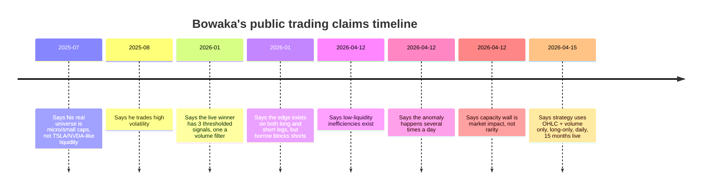
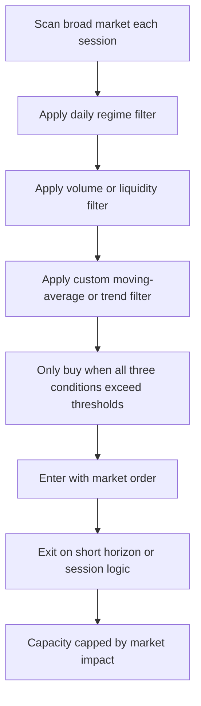

# Bowaka’s Reddit Claims and the Most Likely Low-Liquidity Stock Anomaly He Is Exploiting

## Executive summary

This review of Bowaka’s publicly retrievable history on entity["company","Reddit","social platform"] found a consistent cluster of trading-related statements concentrated from mid-2025 through April 2026, even though the account itself dates to June 26, 2022. Across those comments, Bowaka repeatedly says that his profitable edge is in **micro-/small-cap names, high volatility, and “low liquidity efficiencies”**, not in very liquid names like entity["company","Tesla","ev maker us"] or entity["company","NVIDIA","chipmaker us"]. He describes a **simple three-condition rule set** built from **OHLC + volume**, says the anomaly appears **several times a day**, says capacity is limited by **his own market impact**, and notes that he uses **market orders**, trades **long-only**, and avoids the short side mainly because **borrow availability is unreliable** in that universe. citeturn22view0turn16view3turn32reddit0turn33reddit0turn34reddit0turn31view0

The most defensible inference is that Bowaka is **not** exploiting an order-book manipulation signal such as spoofing or a direct wash-trading detector. His own statements cut against that: he says the live strategy uses only OHLC and volume, not live depth or proprietary order-book features. The anomaly he most likely exploits is a **thin-book, attention-driven continuation/dislocation effect in small-cap and microcap equities during hype windows**: first filter the session’s universe, then buy only when a volume condition, a daily-regime condition, and a moving-average/trend condition all align. The edge appears to be structural rather than informational: **too small for large institutions to care about, but still large enough for a retail-sized account to monetize until market impact becomes binding**. citeturn13view0turn20view2turn33reddit0turn34reddit0

Public market examples with similar characteristics support that interpretation. Comparable microcaps such as entity["company","American Rebel Holdings","nasdaq areb us"], entity["company","Healthcare Triangle","nasdaq hcti us"], entity["company","CareCloud","nasdaq ccld us"], and entity["company","Sky Quarry","nasdaq skyq us"] show exactly the kind of fragile liquidity and narrative-driven price behavior that Bowaka describes: reverse splits, tiny post-split share counts or low effective floats, sudden financing events, extended percentage moves on modest dollar turnover, and in one case even a Nasdaq halt. Those are the market conditions in which a $10,000 order and a $100,000 order can plausibly behave very differently. citeturn45search2turn45search8turn43search4turn38search0turn37search0turn44search0turn36search5turn49view0turn48view0turn47view0

## Corpus and method

The evidence base here consists of Bowaka’s public profile pages, paginated comment history, comment JSON endpoints, and indexed Reddit search results, supplemented with public materials from the entity["organization","U.S. Securities and Exchange Commission","us securities regulator"], entity["organization","FINRA","us self regulator"], and entity["organization","Nasdaq","stock exchange operator"], plus publicly accessible historical daily-price pages for candidate exemplar stocks. Where proprietary depth-of-book or true TAQ-style historical intraday data was unavailable, this report explicitly says so and limits the inference accordingly. citeturn30view0turn42search0turn42search2turn39view0turn40view0turn41view0

A crucial limitation is that the most probative datasets for this question — full order-book history, broker borrow inventory, consolidated short-interest plus exchange-level short volume, and trader-level wash-trade attribution — are **not** available from this environment. FINRA’s daily short-sale volume files are useful, but FINRA itself stresses that they are **off-exchange/publicly disseminated only**, are **not consolidated with exchange data**, and should **not** be confused with bimonthly short-interest positions. Nasdaq’s own public pages for some microcap names also intermittently returned “Data is currently not available” during this review. That means the report can test hypotheses at a **structural** level, but not prove the exact live signal Bowaka runs. citeturn42search0turn42search2turn42search6turn40view0turn41view0

Within those constraints, the method was straightforward: first extract Bowaka’s explicit claims; then compare those claims against public market-structure facts about microcaps; then test whether comparable low-liquidity names exhibit the kind of **high percentage moves on limited notional turnover** that would make Bowaka’s “market impact” explanation plausible. The result is an inference, not a replication. citeturn33reddit0turn34reddit0turn50search0

## What Bowaka explicitly says

Bowaka’s own comments are unusually specific on the broad shape of his strategy, even though they omit the actual thresholds. The clearest direct statements are these:

| Claim category | Bowaka’s public statement | What it implies |
|---|---|---|
| Universe | He contrasts his actual universe with highly liquid names such as Tesla and NVIDIA and says he is “moving on micro/small caps mainly,” adding that larger orders can shift prices there. citeturn22view0 | The strategy is capacity-constrained and deliberately avoids mega-cap liquidity. |
| Regime | He says, “I play on high volatility.” citeturn20view1 | He is not harvesting a sleepy low-volatility anomaly. |
| Core edge | He says “low liquidity efficiencies exist,” that it took him six years to find one, and that the bottleneck is “market impact,” not raw signal frequency. citeturn33reddit0 | The edge is structural and size-limited, not a broad market beta exposure. |
| Signal design | He says his “currently winning strat has just 3 signals,” including “a volume indicator to filter out pure garbage,” and writes the entry condition as “X1 > t1 and X2 > t2 and X3 > t3.” citeturn32reddit0 | A simple threshold-based screen, not a complex latent-factor or ML model. |
| Filters | Elsewhere he says he has “3 filters (1 volume, 1 daily, and 1 moving average based on a ‘secret’ recipe).” citeturn20view2 | One of the three conditions is clearly trend or trend-proxy related. |
| Data inputs | He says “OHLC + Volume only,” “Long only, no options,” and that the live strategy has run successfully for about 15 months. citeturn34reddit0 | This is compatible with a price/volume regime strategy, not direct L2 manipulation detection. |
| Execution | He says he uses market orders and prefers them to limit orders because timing matters more than spread, while assuming a theoretical gross return above 1% per trade. citeturn13view2 | That favors a move-following or fast-dislocation setup over passive liquidity provision. |
| Volume nuance | He explicitly says he does **not** “necessarily go for low volume,” because he scans the whole market, narrows the universe for the session, then looks for specific conditions. citeturn13view0 | The anomaly is not “buy every illiquid stock”; it is a conditional setup inside a selected daily cohort. |
| Short side | He says the edge exists on both the long and short leg, but he does not run the short leg because borrow supply is problematic. citeturn31view0 | Hard-to-borrow microcaps matter, but shorting is operationally messier than the long implementation. |

Those statements are internally coherent. They point to a trader who thinks primarily in terms of **liquidity regime, threshold conditions, and execution friction**, not in terms of fundamentals, valuation, or sophisticated predictive modeling. They also make it very unlikely that the live edge is based on something requiring private lender inventory or deep order-book state, because Bowaka repeatedly frames the strategy as intentionally simple and OHLCV-based. citeturn32reddit0turn34reddit0turn13view0

The chronology below shows how the description tightens over time.

The timeline condenses Bowaka’s dated public statements from mid-2025 through April 15, 2026. citeturn22view0turn20view1turn32reddit0turn33reddit0turn34reddit0

## The most likely anomaly and inferred trading strategy

The best synthesis of the evidence is that Bowaka is exploiting a **low-liquidity continuation/dislocation anomaly** in small and micro caps during attention-rich periods. In plain English: a stock enters a hype or high-volatility regime; volume and price behavior identify it as “in play”; a very simple rule then buys only when a custom trend/moving-average condition and at least one other daily/regime condition confirm that the move is structurally live rather than random noise. Execution is aggressive because the edge is big enough to justify crossing the spread, but only up to the point where Bowaka’s own orders start meaningfully moving price. citeturn33reddit0turn20view2turn13view2turn34reddit0

A more concrete reconstruction looks like this:

This interpretation fits Bowaka’s comments better than a pure mean-reversion story. A trader harvesting passive mean reversion in thin names would normally care more about **providing** liquidity and less about immediate market-order timing. Bowaka says the opposite: he accepts spread cost because delayed fills are worse than crossing the spread. That is exactly the logic of a strategy that expects **continuation after a regime transition** or a **liquidity vacuum that keeps moving in the same direction long enough to overwhelm spread cost**. citeturn13view2

It also fits the fact that he says one condition is a **moving-average-based** filter and another is a **daily** filter. That sounds much more like “only trade names in a specific directional context” than “fade any random spike in a thin stock.” The volume condition then acts less like the edge itself and more like Bowaka’s own phrase: a way to filter out “pure garbage.” citeturn20view2turn32reddit0

The wording “daily strategy” does not contradict the claim that the anomaly appears several times a day. The cleanest reconciliation is that Bowaka uses **daily/session-level filtering** to define the eligible universe, then takes **multiple intraday opportunities** inside that universe. His own storage comment — daily/hourly parquet data with lower granularity fetched only after a first filter — points in exactly that direction. citeturn34reddit0turn33reddit0turn30view0

## Evidence from comparable microcaps

Bowaka never publicly names the live tickers behind this strategy in the material reviewed here. The only explicit ticker examples he names are liquid counterexamples, Tesla and NVIDIA. So the comparison below uses **candidate exemplar names** that match the structural conditions he describes rather than claiming these were his actual trades. citeturn22view0

| Candidate stock | Public structural clue | Example public price/volume window | Why it fits Bowaka’s described universe |
|---|---|---|---|
| American Rebel Holdings | Post–reverse-split common shares outstanding were only **227,554**, and Nasdaq later halted the stock for additional information. citeturn45search2turn45search8 | On Mar. 19–20, 2026, daily volume was **111,379** then **74,926** shares, with closes of **$9.21** and **$6.46**. That is roughly **49%** and **33%** of the entire post-split share count trading in one day. citeturn49view0turn45search2 | This is an extreme illustration of Bowaka’s “10k vs 100k” point: in this kind of name, even modest market orders can become non-trivial. |
| Healthcare Triangle | A 1-for-60 reverse split cut outstanding shares to about **756,984**; the company then announced a registered direct financing later that month. citeturn43search4turn38search0 | On Feb. 26, 2026, volume hit **14,434,744** shares at a **$5.02** close, after **5,234,653** shares traded the prior day. That is an enormous turnover figure relative to the post-split share base, followed by a steep slide in the next sessions. citeturn48view0turn43search4turn38search0 | This is the kind of narrative-plus-financing microcap that can offer a strong intraday setup but also violent dilution risk. |
| CareCloud | Nasdaq-highlighted Q2 2025 gain of about **70%**, tied to a Russell Microcap inclusion and AI-related corporate narrative. citeturn37search0turn37search2 | In the Mar. 11–17, 2026 window, the stock moved from **$3.06** to **$3.61** while daily volume expanded from **622,119** to **1,413,601** shares. That is a clean public example of price-plus-volume confirmation in a microcap-sized name. citeturn47view0 | This looks much closer to a tradable “in-play” small-cap momentum regime than a one-off fraud event. |
| Sky Quarry | Reverse split announced Mar. 5, 2026, effective Mar. 16, 2026. citeturn44search0 | A public market recap identified SKYQ as a top intraday mover on Apr. 2, 2026, up **77.1%**, with “no major catalysts identified,” while the company itself also put out a macro/oil-price narrative release that morning. citeturn36search5turn45search4 | This is exactly the sort of “hype period” dislocation Bowaka says he prefers: strong move, thin name, unclear boundary between catalyst and momentum-chasing. |

Those names are useful because they demonstrate that Bowaka’s capacity explanation is not hand-waving. Using only public daily data, one can estimate that:

- CareCloud’s March 2026 move occurred on roughly **$2 million to $5 million** of daily notional turnover.  
- American Rebel’s Mar. 19, 2026 session was only about **$1 million** of daily notional turnover.  
- Healthcare Triangle’s financing day was abnormally larger, but its surrounding sessions often traded on only a few hundred thousand to a couple million dollars of notional value. citeturn47view0turn49view0turn48view0

That is precisely the zone where Bowaka’s statement becomes economically credible: a $10,000 order is manageable, while a $100,000 market order is no longer “small” relative to the available tape and the day’s effective liquidity. citeturn33reddit0turn22view0turn47view0turn49view0turn48view0

## Why some alternative explanations fit poorly

A **direct spoofing/layering strategy** is a poor fit. Those patterns live in quote placement, cancellation, queue dynamics, and depth distribution. Bowaka, by contrast, says the live strategy uses only OHLC and volume and is intentionally simple. That does not rule out the possibility that spoofing or book games help *create* the moves he trades, but it makes it unlikely that his edge is “I detect spoofing in real time and trade against it.” citeturn34reddit0turn32reddit0

A **pure wash-trading or pump-and-dump detector** is also not the best fit. The SEC’s own microcap guidance does say that thinly traded microcaps are highly vulnerable to manipulation and that even modest trade size can move prices sharply. But Bowaka explicitly says he does not simply target low-volume names; he scans broadly, filters the session, and then trades only a subset in high-volatility hype windows. That sounds more like systematic trading of a structural consequence of thin markets than direct forensic detection of unlawful activity. citeturn50search0turn13view0turn23reddit0

A **short-squeeze-specific long strategy** is plausible as a subcase, but not sufficient as the whole explanation. Bowaka says the short side of the same edge is harder to implement because borrow is unreliable, and SEC/Reg SHO materials caution that threshold status or close-out activity should not be over-interpreted as proof of a squeeze-driven move. So borrow scarcity matters, but it looks like an operational obstacle around the short version of the setup, not the sole driver of the long version. citeturn31view0turn50search3

The strongest reading, then, is narrower and more defensible: Bowaka likely trades **attention-induced directional persistence and liquidity vacuums** in small-cap or microcap names once they enter a tradable regime. Some of those regimes may be caused by legitimate news, some by promotional narrative, some by reverse-split distortions, some by financing or float mechanics, and some by manipulation. But his *signal* is probably not “detect the cause.” It is probably “detect when the tape and the session context say the move is statistically tradable.” citeturn33reddit0turn34reddit0turn50search0

## Bottom-line inference

The most likely anomaly Bowaka claims to exploit is **a small-cap/microcap low-liquidity continuation effect that appears after an attention shock** — usually in high-volatility “hype periods” — where a stock’s price movement persists enough that a simple OHLCV-based threshold rule can buy it profitably even after paying the spread with a market order. The edge seems to depend on three things happening together:

1. a stock enters the right **daily/session regime**,  
2. **volume/liquidity** is high enough to be tradable but still thin enough that the market is not fully efficient, and  
3. a **trend or moving-average confirmation** says the move is live rather than random. citeturn20view2turn32reddit0turn33reddit0turn34reddit0

Put more compactly, Bowaka’s public comments are most consistent with a **“trade the in-play microcap runner”** system, not with a fundamental stock-picking model, not with a deep-order-book alpha model, and not with a generic penny-stock fraud detector. His claim is that this works precisely because the niche is **too small and too messy for large capital**, yet still systematic enough for a disciplined retail trader with a small but growing account. citeturn22view0turn33reddit0turn34reddit0

## Limitations and prioritized next investigative steps

This report cannot validate Bowaka’s exact live rules or actual positions, because no private account records, broker logs, or proprietary TAQ/L2 datasets were available. The absence of true consolidated intraday depth data matters. Nasdaq’s public pages for some microcaps were intermittently unavailable, and FINRA’s short-sale volume files are informative but incomplete by construction. citeturn40view0turn41view0turn42search2turn42search6

The highest-value next steps are therefore:

1. **Assemble a replayable candidate universe** of U.S.-listed micro-/small-cap names with reverse splits, financings, or “AI/crypto/biotech” narrative spikes from 2025–2026, starting with AREB, HCTI, CCLD, and SKYQ. Use SEC filings plus Nasdaq press releases to anchor the exact event windows. citeturn45search2turn43search4turn37search0turn44search0  
2. **Pull true intraday bars and depth** for those windows from a licensed feed. The goal is to test whether continuation after the first volume shock dominates reversal once Bowaka’s likely filters are approximated.  
3. **Combine FINRA daily short-sale volume with exchange volume and Reg SHO lists** instead of treating FINRA short volume in isolation. FINRA explicitly warns against doing that. citeturn42search2turn42search6turn50search3  
4. **Measure turnover versus post-split or post-filing share counts**, especially for names like AREB and HCTI, because Bowaka’s “market impact” thesis should grow stronger as daily turnover approaches a large fraction of shares outstanding. citeturn45search2turn49view0turn43search4turn48view0  
5. **Reconstruct a session-level scanner** using only OHLCV: abnormal relative volume, daily-range expansion, price above a custom moving-average proxy, and a volatility gate. That is the closest public approximation of Bowaka’s own description. citeturn20view2turn32reddit0turn34reddit0  
6. **Test long-only continuation against short-side fade variants separately.** Bowaka himself implies the short signal may exist but is harder to monetize because borrow availability is unstable. citeturn31view0  
7. **Tag each event by catalyst class** — real filing, financing, reverse split, vague promotional narrative, “no major catalyst identified” — to see whether the edge is strongest in legitimate-news continuation or in structurally thin narrative names. citeturn38search0turn44search0turn36search5  
8. **Quantify slippage sensitivity by order size** on a simulated ladder of $10k, $25k, $50k, and $100k market orders. Bowaka’s public claim rises or falls on that capacity curve. citeturn33reddit0turn22view0  
9. **Map social-timeline accelerants** around the candidate windows, especially Reddit/Stocktwits/X chatter bursts, to test whether the anomaly is really “low liquidity” or “low liquidity plus attention shock.”  
10. **Separate tradable continuation from manipulation risk.** SEC guidance on microcaps makes clear that thinly traded names are fertile ground for both legitimate dislocation and fraud; the trading signal may work without being able to classify which is which in real time. citeturn50search0turn50search4

The central conclusion remains: Bowaka’s public trail does **not** read like someone exploiting a hidden predictive fundamental signal or a sophisticated order-book alpha. It reads like someone exploiting a **small, repeatable, capacity-limited liquidity distortion in “in-play” microcaps**, using a deliberately simple OHLCV rule set and accepting that the edge stops scaling once his own orders become part of the problem. citeturn33reddit0turn32reddit0turn34reddit0