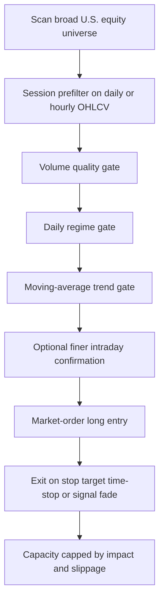

# Inferring Bowaka’s Tracking Logic from His Reddit History

## Executive summary

Across the publicly retrievable trading-related comments I reviewed through April 15, 2026, Bowaka consistently describes a **long-only, OHLCV-based, thresholded stock strategy** built from **three filters**: one tied to **volume**, one tied to a **daily/session condition**, and one tied to a **moving-average condition**. He says he trades **high volatility**, scans the **whole market** rather than blindly buying “low-volume” names, narrows to a session-specific subset, then looks for **more granular conditions**. He also says his edge is constrained by **market impact**, not rarity, and that he uses **market orders** because the expected move per trade is large enough that timing matters more than spread capture. citeturn26view2turn8view2turn8view3turn11view1turn8view1turn28view0

The tightest inference is that Bowaka is tracking an **“in-play microcap / small-cap state”**, not a static bucket of penny stocks. In practical terms, that state appears to be: **abnormal participation**, **abnormal daily movement**, and **short-horizon trend confirmation**, followed by a time-sensitive long entry. The public analogs that best match his descriptions are reverse-split or financing-distorted small-cap names that can move violently on modest or episodic liquidity, such as AREB, HCTI, CCLD, and SKYQ. Those corporate and narrative events look less like his core signal and more like the **context** that creates the regime he wants to trade. citeturn12view3turn8view2turn11view1turn19search1turn20search0turn18search1turn18search0

## Methods and source corpus

Bowaka’s profile shows a cake day of June 26, 2022 and 585 contributions. In this pass, I directly reviewed the visible profile page, three paginated comment JSON pages containing 100 comments each, and the visible submissions page containing 34 posts. The trading-relevant material in the accessible corpus is concentrated in 2025–2026; the visible submissions page itself was not trading-focused. That means this report is grounded in Bowaka’s accessible public corpus, but deleted items, deeper pagination, and inaccessible fragments could still exist outside what I directly retrieved here. citeturn26view0turn4view0turn5view0turn6view0turn17view0

Public cross-checking relied on filings from the entity["organization","U.S. Securities and Exchange Commission","us regulator"], exchange notices and issuer releases carried by entity["company","Nasdaq","exchange operator"], short-sale documentation from entity["organization","FINRA","us self regulator"], and daily price/volume history pages from entity["company","Stock Analysis","market data site"]. I did **not** have licensed historical TAQ, archived Level II, historical short-locate inventories, or broker fills. That matters because FINRA explicitly says its daily short-sale files are **off-exchange**, **not consolidated with exchange data**, and **not equivalent to bi-monthly short interest**. So what follows is a high-confidence reconstruction of Bowaka’s **signal family**, not a proof of his exact production implementation. citeturn25search2turn25search4turn25search0

| Priority | Source class | Why it sits high in the stack | How I used it |
|---|---|---|---|
| Highest | Bowaka’s public Reddit comments/profile | Only direct statements of what he says he trades | Core inference |
| High | SEC filings | Primary record of reverse splits, financings, outstanding shares | Structural validation |
| High | Nasdaq notices / issuer releases | Exchange compliance, halts, listing context | Event timing and regime context |
| Medium | FINRA short-sale documentation/files | Useful for short-side context, but easy to misuse | Limitation setting and future work |
| Medium | Stock Analysis daily-history pages | Convenient public daily OHLCV windows | Candidate-stock comparisons |
| Lower | OTC / venue pages / social timelines | Contextual only unless directly tied to a name | Optional enrichment |

That priority order follows Bowaka’s own repeated claim that the live strategy is built from simple public OHLCV features, while SEC, Nasdaq, and FINRA materials are better used as **context and validation layers** than as the core long-entry signal itself. citeturn8view4turn8view3turn11view1turn25search2turn19search1

## What Bowaka explicitly says

The table below condenses the strongest public clues.

| Topic | What Bowaka says publicly | Analytical meaning |
|---|---|---|
| Universe bias | He says that if you trade indexes or highly liquid names such as **entity["company","Tesla","ev maker"]** or **entity["company","Nvidia","chip designer"]**, liquidity concerns are different, but that he is “moving on micro/small caps mainly.” He also says he is more cautious now on a 100k account than when he had 20k. citeturn12view3 | His live edge is capacity-sensitive and aimed at smaller names. |
| Not simply “buy low volume” | He says, “I don’t necessarily go for low volume,” because he scans the whole market, applies a first filter for the ongoing session, and then looks for more granular conditions inside that pool. citeturn8view2 | The edge is a **conditional regime**, not a static low-liquidity list. |
| Data inputs | He says, “OHLC + Volume only,” “Long only, no options,” and describes the current winner as a daily strategy run live successfully for 15 months. citeturn8view4 | The live system is price/volume based, not an order-book detector. |
| Filter structure | He says his winning strategy has “just 3 signals,” including “a volume indicator to filter out pure garbage,” with an entry flag of `X1 > t1 and X2 > t2 and X3 > t3`. Elsewhere he says he has “3 filters (1 volume, 1 daily, and 1 moving average).” citeturn8view3turn11view1 | This is the single strongest clue: **volume gate + daily regime gate + trend/MA gate**. |
| Regime preference | He says, “I play on high volatility.” citeturn28view0 | A volatility gate is probably central, not incidental. |
| Execution | He says he uses market orders, not limits, because limit orders can destroy timing, while his theoretical return is above 1% per trade and can absorb spread/liquidity as long as sizing stays reasonable. citeturn26view2 | He is likely trading continuation/dislocation, not passive spread capture. |
| Capacity wall | He says “low liquidity efficiencies exist,” that it took him six years to find the edge, and that the anomaly occurs several times a day but the bottleneck is his own market impact: 10k and 100k orders do not enter the same way. citeturn26view2 | The anomaly is repeatable but non-scalable. |
| Short side | He says the edge exists on both the long and short legs, but he does not run the short leg because he cannot backtest borrow availability cleanly and skips it for now. citeturn14reddit37 | Borrow friction matters; the long implementation is the cleaner one. |
| Design philosophy | He says “simple” means 2–3 features plus handmade rules that are not fine-tuned automatically, and that the current strategy is simple enough for a high-school student to understand once discovered. citeturn27view0turn27view1 | The published clues point to **simple threshold logic**, not ML or complex optimization. |
| Research pipeline | He says he stores daily/hourly data, then uses strategy plug-ins to transform/filter it and only fetch lower granularity after a first filtering layer. citeturn16view0 | This strongly supports a **coarse scan → finer trigger** architecture. |

Taken together, these comments point to a single coherent object: Bowaka is most likely tracking a stock that has **entered a tradeable attention/liquidity regime**, where enough volume has appeared to make a market-order entry feasible, but not so much depth has appeared that the small-cap becomes fully efficient. The moving-average condition then acts as the directional confirmation that the dislocation is **live and tradable**, not just random noise. citeturn8view2turn8view3turn11view1turn26view2

In the accessible trading corpus I reviewed, I did **not** find disclosed live trade screenshots or named production tickers. The only specific tickers Bowaka volunteered were counterexamples — TSLA and NVDA — used to explain why his own universe behaves differently. citeturn12view3turn17view0

## Inferred screening logic and indicator definitions

The cleanest reconstruction is a **two-stage system**.

The first stage is a **market-wide prefilter** built on daily or hourly OHLCV, which narrows the universe for the session. That directly matches Bowaka’s description of scanning broadly, filtering once, and only then fetching lower granularity data. The second stage is a **granular entry test** applied only to names already in the day’s eligible pool. Because he also says the anomaly “happens several times a day,” that granular layer is likely where the real-time entry lives, even if the broader strategy is “daily” in the sense of how the universe is selected. citeturn8view2turn8view1turn16view0turn8view4

At the feature level, the tightest answer to “what is he tracking?” is this:

- **Participation / tradeability**: a stock’s volume and dollar-flow are high enough to avoid “pure garbage,” but still low enough that inefficiency remains.
- **Daily regime change**: the name is having an abnormal day — gap, range, RVOL, or ATR expansion.
- **Directional confirmation**: the stock is aligned with a short-horizon moving-average trend.
- **Optional granular trigger**: an intraday confirmation that the regime is still active right now rather than having already exhausted itself.

That is not a claim that Bowaka uses the exact formulas below. It is a disciplined operationalization of the public clues he gave. citeturn8view3turn11view1turn26view2turn27view0



### Most likely signal ingredients

| Layer | Likely variable | Formula or proxy | Confidence | Why this is the best fit |
|---|---|---|---|---|
| Volume quality | Average dollar volume | `ADV_N = mean(Close * Volume, N prior bars)` | High | He explicitly says one filter is volume and is used to remove “pure garbage.” citeturn8view3 |
| Relative participation | Relative volume | `RVOL_N = Volume_t / mean(Volume_{t-N:t-1})` | High | “High volatility” plus a volume gate strongly suggests abnormal participation, not raw volume alone. citeturn8view3turn28view0 |
| Daily movement | ATR percent | `ATRpct_N = ATR_N / Close_t` | High | He explicitly says he “plays on high volatility.” citeturn28view0 |
| Daily expansion | Range expansion | `RangeExp = (High_t - Low_t) / ATR_N` | Medium | This is the most natural OHLCV translation of “abnormal day.” |
| Gap/open state | Gap percent | `GapPct = Open_t / Close_{t-1} - 1` | Medium | A likely session-regime candidate, but not directly published. |
| Closing strength | Close location | `CLV = (Close_t - Low_t) / (High_t - Low_t)` | Medium | Useful for distinguishing continuation days from failed spikes; inferred, not published. |
| Trend/MA filter | EMA distance | `EMAdist = Close_t / EMA_N - 1` | High | He explicitly says the third filter is moving-average based. citeturn11view1 |
| Trend persistence | EMA slope | `EMAslope = EMA_N / EMA_N.shift(k) - 1` | High | The simplest thresholdable MA trend feature consistent with “If feature > threshold -> buy.” citeturn9view1 |
| Optional live confirmation | VWAP deviation | `VWAPdev = LastPrice / VWAP_session - 1` | Medium | He never names VWAP, but it is a natural granular continuation proxy when only OHLCV is allowed. |
| Optional live confirmation | Opening-range break | `LastPrice > OR_high` | Medium | Consistent with time-sensitive market-order entry; not explicitly published. |

### What I think is specified, and what is not

Some parts of the screen are well-grounded in Bowaka’s own words. Others are not.

- **High confidence**: volume filter, daily/session filter, moving-average filter, high-volatility preference, long-only implementation, market-order entry, and capacity limitations from market impact. citeturn8view3turn11view1turn28view0turn8view4turn26view2
- **Medium confidence**: RVOL, ATR%, range expansion, close location, and an open/intraday continuation trigger. These are the most natural OHLCV translations of what he says, but he never names them explicitly. citeturn8view2turn16view0turn26view2
- **Low confidence / left open**: hard market-cap cutoffs, exchange whitelist, price bucket, float cap, shares-outstanding cap, reverse-split flag, recent SEC filing flag, short-interest threshold, narrative tags, and VWAP-specific logic. Bowaka never says he uses any of those directly. My view is that they belong in the **research harness** and candidate selection layer, not necessarily the minimum viable live signal, because he repeatedly describes the live edge as “stupidly simple” and OHLCV-only. citeturn27view0turn27view1turn8view4turn11view1

## Evidence from candidate microcaps

For public analogs, I used **entity["company","American Rebel Holdings","nasdaq areb"]**, **entity["company","Healthcare Triangle","nasdaq hcti"]**, **entity["company","CareCloud","nasdaq ccld"]**, and **entity["company","Sky Quarry","nasdaq skyq"]**. I am **not** claiming these were Bowaka’s live trades. I am using them because they display the structural characteristics his comments imply: reverse splits, financing events, microcap narrative bursts, violent range expansion, and small-cap liquidity profiles where market impact can quickly become nontrivial. citeturn19search1turn20search0turn18search1turn18search0

| Candidate | Public structural clue | Public window that illustrates the regime | What it shows |
|---|---|---|---|
| AREB | On March 23, 2026 the company disclosed that it had **227,554 common shares outstanding** post-split, and Nasdaq then halted the stock for additional information. citeturn19search1turn25search5 | On March 19–20, 2026, volume was **111,379** then **74,926** shares, with closes of **9.21** and **6.46**. That is roughly **49%** and **33%** of the post-split share count turning over in a single day. citeturn22view2turn19search1 | This is exactly the kind of name where Bowaka’s “10k is not 100k” comment becomes economically credible. |
| HCTI | A February 2026 filing says the **1-for-60 reverse split** reduced outstanding common shares from **45,417,091** to **756,984**; a Feb. 26, 2026 8-K then disclosed a registered direct offering for about **$3.95 million**. citeturn20search0turn20search1 | On Feb. 25–27, 2026, volume jumped from **5,234,653** to **14,434,744** then **788,231**, with closes at **5.81**, **5.02**, and **4.14**. The Feb. 26 volume was about **19x** the post-split share count. citeturn23view0turn20search0 | This is a classic “in play” microcap: capital-structure shock, financing event, and enormous turnover relative to float. |
| CCLD | Nasdaq carried a July 2, 2025 issuer release saying the stock had risen about **70% during Q2 2025** and joined the Russell Microcap Index. citeturn18search1 | On Mar. 11–17, 2026, the stock moved from **2.66** to **3.61**, while volume expanded from **460,111** to **1,413,601** shares. citeturn24view1turn24view2 | This looks less like a one-off split distortion and more like a clean small-cap “price + volume + trend” continuation window. |
| SKYQ | A March 5, 2026 filing / release says the company enacted a **1-for-8 reverse split**, leaving about **3,752,874** shares outstanding after the split. citeturn18search0turn19search2 | On Apr. 2, 2026 the stock closed at **5.10** on **199,875,378** shares; on Apr. 7 and Apr. 10 it still traded **72,133,794** and **43,992,040** shares respectively. citeturn22view3 | This is extreme “in play” behavior: once attention fully ignites, the name transitions from quiet microcap to frenzy. |

These examples help distinguish **core signal** from **structural context**. Reverse splits, financing filings, and benchmark/narrative headlines are not necessarily the signal Bowaka trades, but they are exactly the kinds of events that create the **high-volatility, capacity-limited, OHLCV-visible regime** he says he exploits. That is why I would treat them as **research and scanner enrichments**, not mandatory entry features. citeturn26view2turn11view1turn27view1turn19search1turn20search1turn18search1turn18search0

## YAML schema and assumptions

Bowaka disclosed the **feature families**, but he did **not** disclose the exact thresholds or the production values of `X1`, `X2`, `X3`; in fact, he explicitly refused to elaborate because that would leak his edge. The schema below therefore separates **published clues** from **inferred defaults** and flags anything Bowaka left unspecified. citeturn8view3turn1reddit0turn27view0

### Assumed default parameter table

| Parameter | Suggested default | Status relative to Bowaka corpus | Rationale |
|---|---:|---|---|
| `universe.price_min` | `1.0` | Unspecified | Small/micro-cap bias is explicit, but no hard price floor is published. citeturn12view3 |
| `universe.price_max` | `20.0` | Unspecified | Keeps the screen aimed at smaller names without assuming sub-$5 only. Bowaka says “mainly” micro/small caps, not exclusively low-priced pennies. citeturn12view3turn28view0 |
| `universe.avg_dollar_volume_min` | `250000` | Inferred | He uses market orders and says spread/liquidity are absorbable if he sizes reasonably, so an ultra-low ADV floor would contradict execution reality. citeturn26view2 |
| `universe.avg_dollar_volume_max` | `null` | Inferred open | He explicitly says he does **not necessarily** target low volume and scans the whole market first. citeturn8view2 |
| `signals.rvol_min` | `1.5` | Inferred | Best OHLCV translation of his explicit volume filter. citeturn8view3 |
| `signals.atr_pct_min` | `0.06` | Inferred | Best OHLCV translation of “I play on high volatility.” citeturn28view0 |
| `signals.ema_days` | `10` | Unspecified | He states a moving-average filter exists, but not the period. citeturn11view1 |
| `signals.ema_slope_lookback` | `3` | Unspecified | Natural short-horizon trend proxy for daily use. |
| `signals.close_location_min` | `0.60` | Inferred | Continuation-style translation of a time-sensitive long entry. |
| `execution.position_size_frac` | `0.10` | Published for his own style | He says he plays “10% to 20% / bet,” which is aggressive and should be treated as Bowaka-like, not universally prudent. citeturn8view4 |
| `execution.entry_mode` | `"next_open_market"` | Inferred | Consistent with market-order preference and timing sensitivity. citeturn26view2 |
| `execution.use_intraday_confirmation` | `true` | Inferred | He says the process becomes more granular after a first filter and that the anomaly appears several times a day. citeturn8view1turn16view0 |

### YAML parameter schema

```yaml
version: int

data:
  timezone: str
  daily_period: str            # e.g. "18mo"
  intraday_period: str         # e.g. "30d"
  intraday_interval: str       # e.g. "5m"
  fetch_yfinance_metadata: bool

universe:
  allowed_exchanges: [str] | null
  market_cap_min: int | null
  market_cap_max: int | null
  shares_outstanding_max: int | null
  float_shares_max: int | null
  price_min: float | null
  price_max: float | null
  avg_dollar_volume_min: float | null
  avg_dollar_volume_max: float | null

indicators:
  lookback_days: int
  atr_days: int
  ema_days: int
  ema_slope_lookback: int

signals:
  rvol_min: float | null
  atr_pct_min: float | null
  range_expansion_min: float | null
  gap_up_min: float | null
  close_location_min: float | null
  ema_distance_min: float | null
  ema_slope_min: float | null

intraday:
  enabled: bool
  opening_range_bars: int
  opening_range_rvol_min: float | null
  vwap_dev_min: float | null
  require_breakout_above_opening_range: bool
  fallback_to_daily_proxy: bool

execution:
  entry_mode: str              # "next_open_market" or "same_close_market"
  stop_loss_pct: float
  take_profit_pct: float
  max_hold_days: int
  exit_on_signal_fade: bool
  position_size_frac: float
  max_concurrent_positions: int
  max_position_as_adv_frac: float

  slippage:
    base_bps: float
    impact_coeff: float
    max_pct: float

backtest:
  start: str                   # YYYY-MM-DD
  end: str                     # YYYY-MM-DD
  intrabar_priority: str       # "stop", "target", or "worst_case"

output:
  screener_csv: str
  trade_log_csv: str
  performance_csv: str
```

### Example YAML

```yaml
version: 1

data:
  timezone: "America/New_York"
  daily_period: "18mo"
  intraday_period: "30d"
  intraday_interval: "5m"
  fetch_yfinance_metadata: true

universe:
  allowed_exchanges: ["NASDAQ", "NYSE", "NYSEAMERICAN"]
  market_cap_min: null
  market_cap_max: 500000000
  shares_outstanding_max: 50000000
  float_shares_max: null
  price_min: 1.0
  price_max: 20.0
  avg_dollar_volume_min: 250000
  avg_dollar_volume_max: null

indicators:
  lookback_days: 20
  atr_days: 14
  ema_days: 10
  ema_slope_lookback: 3

signals:
  rvol_min: 1.5
  atr_pct_min: 0.06
  range_expansion_min: 1.25
  gap_up_min: 0.00
  close_location_min: 0.60
  ema_distance_min: 0.00
  ema_slope_min: 0.00

intraday:
  enabled: true
  opening_range_bars: 6        # 6 x 5m = first 30 minutes
  opening_range_rvol_min: 1.25
  vwap_dev_min: 0.00
  require_breakout_above_opening_range: false
  fallback_to_daily_proxy: true

execution:
  entry_mode: "next_open_market"
  stop_loss_pct: 0.08
  take_profit_pct: 0.15
  max_hold_days: 3
  exit_on_signal_fade: true
  position_size_frac: 0.10
  max_concurrent_positions: 4
  max_position_as_adv_frac: 0.03

  slippage:
    base_bps: 10
    impact_coeff: 0.015
    max_pct: 0.015

backtest:
  start: "2025-01-01"
  end: "2026-04-15"
  intrabar_priority: "stop"

output:
  screener_csv: "stocks_in_play.csv"
  trade_log_csv: "trade_log.csv"
  performance_csv: "performance_summary.csv"
```

### Example candidate ticker CSV

```csv
ticker,label,exchange,market_cap,shares_outstanding,float_shares,narrative_tags
AREB,post-split tiny float,NASDAQ,,,,"reverse_split;halt_risk"
HCTI,split plus financing,NASDAQ,,,,"reverse_split;financing"
CCLD,microcap AI-healthcare,NASDAQ,,,,"ai;narrative"
SKYQ,split energy microcap,NASDAQ,,,,"reverse_split;energy"
```

## Runnable Python scripts

The code below intentionally implements **Bowaka-like classes of features** — volume, daily regime, and moving-average trend — while leaving every threshold configurable because Bowaka disclosed the feature families but withheld the actual thresholds and refused to publish `X1`, `X2`, and `X3`. The script also treats reverse splits, filings, and narrative tags as **optional context fields**, not mandatory live-entry features, because Bowaka repeatedly describes the live strategy as “OHLC + Volume only.” citeturn8view3turn11view1turn8view4turn27view0turn1reddit0

### Screener script

```python
# save as: bowaka_screener.py
# Python 3.10+
#
# Purpose:
#   Read YAML + ticker CSV, pull daily data (and optional recent intraday data),
#   compute Bowaka-like OHLCV features, and output a CSV of "stocks in play".
#
# Open-source dependencies:
#   pip install pandas numpy yfinance pyyaml

from __future__ import annotations

import argparse
import math
from pathlib import Path
from typing import Dict, Any, Tuple, Optional

import numpy as np
import pandas as pd
import yfinance as yf
import yaml


def load_config(path: str | Path) -> Dict[str, Any]:
    with open(path, "r", encoding="utf-8") as f:
        return yaml.safe_load(f)


def safe_float(x, default=np.nan):
    try:
        if x is None or x == "":
            return default
        return float(x)
    except Exception:
        return default


def fetch_ohlcv(
    ticker: str,
    period: str,
    interval: str = "1d",
    auto_adjust: bool = False,
    prepost: bool = False,
) -> pd.DataFrame:
    data = yf.download(
        ticker,
        period=period,
        interval=interval,
        auto_adjust=auto_adjust,
        prepost=prepost,
        progress=False,
        threads=False,
    )
    if data.empty:
        return pd.DataFrame()

    if isinstance(data.columns, pd.MultiIndex):
        data.columns = data.columns.get_level_values(0)

    data = data.reset_index()
    data.columns = [str(c) for c in data.columns]
    return data


def fetch_metadata(ticker: str) -> Dict[str, Any]:
    """
    Yahoo metadata can be incomplete or flaky.
    We treat it as optional and allow the ticker CSV to override or fill values.
    """
    meta = {
        "exchange": None,
        "market_cap": np.nan,
        "shares_outstanding": np.nan,
        "float_shares": np.nan,
    }
    try:
        tk = yf.Ticker(ticker)
        info = tk.get_info()
        meta["exchange"] = info.get("exchange")
        meta["market_cap"] = safe_float(info.get("marketCap"))
        meta["shares_outstanding"] = safe_float(info.get("sharesOutstanding"))
        meta["float_shares"] = safe_float(info.get("floatShares"))
    except Exception:
        pass
    return meta


def compute_atr(df: pd.DataFrame, n: int) -> pd.Series:
    prev_close = df["Close"].shift(1)
    tr = pd.concat(
        [
            df["High"] - df["Low"],
            (df["High"] - prev_close).abs(),
            (df["Low"] - prev_close).abs(),
        ],
        axis=1,
    ).max(axis=1)
    return tr.rolling(n).mean()


def compute_daily_features(df: pd.DataFrame, cfg: Dict[str, Any]) -> pd.DataFrame:
    out = df.copy()
    out["Date"] = pd.to_datetime(out["Date"]).dt.tz_localize(None)
    out = out.sort_values("Date").reset_index(drop=True)

    lookback = int(cfg["indicators"]["lookback_days"])
    atr_days = int(cfg["indicators"]["atr_days"])
    ema_days = int(cfg["indicators"]["ema_days"])
    slope_lb = int(cfg["indicators"]["ema_slope_lookback"])

    out["DollarVolume"] = out["Close"] * out["Volume"]
    out["AvgDollarVolume"] = out["DollarVolume"].shift(1).rolling(lookback).mean()
    out["AvgVolume"] = out["Volume"].shift(1).rolling(lookback).mean()
    out["RVOL"] = out["Volume"] / out["AvgVolume"]

    out["ATR"] = compute_atr(out, atr_days)
    out["ATRPct"] = out["ATR"] / out["Close"]

    out["GapPct"] = out["Open"] / out["Close"].shift(1) - 1.0
    out["RangePct"] = (out["High"] - out["Low"]) / out["Close"]
    out["RangeExpansion"] = (out["High"] - out["Low"]) / out["ATR"]

    rng = (out["High"] - out["Low"]).replace(0, np.nan)
    out["CloseLocation"] = ((out["Close"] - out["Low"]) / rng).fillna(0.5)

    out["EMA"] = out["Close"].ewm(span=ema_days, adjust=False).mean()
    out["EMADistance"] = out["Close"] / out["EMA"] - 1.0
    out["EMASlope"] = out["EMA"] / out["EMA"].shift(slope_lb) - 1.0

    # Useful secondary context
    out["Ret1"] = out["Close"].pct_change(1)
    out["Ret3"] = out["Close"].pct_change(3)
    out["Ret5"] = out["Close"].pct_change(5)

    return out


def compute_intraday_context(
    intraday_df: pd.DataFrame,
    opening_range_bars: int,
) -> Dict[str, Any]:
    """
    Optional intraday confirmation layer.
    If recent intraday is unavailable, the caller can fall back to daily proxies.

    For simplicity:
      - We compare today's first-N-bars volume to the mean first-N-bars volume of prior sessions.
      - We compute current session VWAP and whether price is above the opening-range high.
    """
    if intraday_df.empty:
        return {}

    out = intraday_df.copy()
    dt_col = "Datetime" if "Datetime" in out.columns else out.columns[0]
    out[dt_col] = pd.to_datetime(out[dt_col], utc=True, errors="coerce")

    # Convert to naive timestamps for grouping by session day.
    out["SessionDate"] = out[dt_col].dt.tz_convert("America/New_York").dt.date
    out = out.sort_values(dt_col).reset_index(drop=True)

    sessions = [g.copy() for _, g in out.groupby("SessionDate") if len(g) >= opening_range_bars]
    if not sessions:
        return {}

    current = sessions[-1].copy()
    prior = sessions[:-1]

    current["Typical"] = (current["High"] + current["Low"] + current["Close"]) / 3.0
    current["CumVolume"] = current["Volume"].cumsum()
    current["VWAP"] = (current["Typical"] * current["Volume"]).cumsum() / current["CumVolume"].replace(0, np.nan)

    orb = current.head(opening_range_bars)
    or_high = float(orb["High"].max())
    or_low = float(orb["Low"].min())
    or_vol = float(orb["Volume"].sum())

    prior_or_vols = []
    for s in prior:
        prior_or_vols.append(float(s.head(opening_range_bars)["Volume"].sum()))
    or_rvol = np.nan if len(prior_or_vols) == 0 else or_vol / np.mean(prior_or_vols)

    last_row = current.iloc[-1]
    return {
        "intraday_last_close": float(last_row["Close"]),
        "intraday_vwap": float(last_row["VWAP"]),
        "intraday_vwap_dev": float(last_row["Close"] / last_row["VWAP"] - 1.0) if last_row["VWAP"] else np.nan,
        "opening_range_high": or_high,
        "opening_range_low": or_low,
        "opening_range_breakout": bool(float(last_row["Close"]) > or_high),
        "opening_range_rvol": float(or_rvol) if not np.isnan(or_rvol) else np.nan,
    }


def merge_metadata(row: pd.Series, yahoo_meta: Dict[str, Any]) -> Dict[str, Any]:
    meta = dict(yahoo_meta)
    # CSV values override Yahoo if present
    for key_csv, key_out in [
        ("exchange", "exchange"),
        ("market_cap", "market_cap"),
        ("shares_outstanding", "shares_outstanding"),
        ("float_shares", "float_shares"),
    ]:
        if key_csv in row and pd.notna(row[key_csv]) and row[key_csv] != "":
            meta[key_out] = row[key_csv]
    # numeric normalization
    for k in ["market_cap", "shares_outstanding", "float_shares"]:
        meta[k] = safe_float(meta.get(k))
    return meta


def evaluate_signal_from_row(
    row: pd.Series,
    meta: Dict[str, Any],
    cfg: Dict[str, Any],
    intraday_ctx: Optional[Dict[str, Any]] = None,
) -> Tuple[bool, str]:
    U = cfg["universe"]
    S = cfg["signals"]
    I = cfg["intraday"]

    checks = []
    reasons = []

    def bound_ok(name: str, value: float, lo=None, hi=None) -> bool:
        if pd.isna(value):
            reasons.append(f"{name}=NA")
            return False
        if lo is not None and value < lo:
            reasons.append(f"{name}<{lo}")
            return False
        if hi is not None and value > hi:
            reasons.append(f"{name}>{hi}")
            return False
        reasons.append(f"{name}={value:.4g}")
        return True

    # Universe filters
    if U.get("allowed_exchanges"):
        exch = (meta.get("exchange") or "").upper()
        exch_ok = exch in {e.upper() for e in U["allowed_exchanges"]}
        checks.append(exch_ok)
        reasons.append(f"exchange={exch or 'NA'}")
    if U.get("market_cap_min") is not None or U.get("market_cap_max") is not None:
        checks.append(bound_ok("market_cap", meta.get("market_cap", np.nan), U.get("market_cap_min"), U.get("market_cap_max")))
    if U.get("shares_outstanding_max") is not None:
        checks.append(bound_ok("shares_outstanding", meta.get("shares_outstanding", np.nan), None, U.get("shares_outstanding_max")))
    if U.get("float_shares_max") is not None:
        checks.append(bound_ok("float_shares", meta.get("float_shares", np.nan), None, U.get("float_shares_max")))
    if U.get("price_min") is not None or U.get("price_max") is not None:
        checks.append(bound_ok("price", row["Close"], U.get("price_min"), U.get("price_max")))
    if U.get("avg_dollar_volume_min") is not None or U.get("avg_dollar_volume_max") is not None:
        checks.append(bound_ok("adv", row["AvgDollarVolume"], U.get("avg_dollar_volume_min"), U.get("avg_dollar_volume_max")))

    # Core Bowaka-like filters
    if S.get("rvol_min") is not None:
        checks.append(bound_ok("rvol", row["RVOL"], S["rvol_min"], None))
    if S.get("atr_pct_min") is not None:
        checks.append(bound_ok("atr_pct", row["ATRPct"], S["atr_pct_min"], None))
    if S.get("range_expansion_min") is not None:
        checks.append(bound_ok("range_exp", row["RangeExpansion"], S["range_expansion_min"], None))
    if S.get("gap_up_min") is not None:
        checks.append(bound_ok("gap_pct", row["GapPct"], S["gap_up_min"], None))
    if S.get("close_location_min") is not None:
        checks.append(bound_ok("close_loc", row["CloseLocation"], S["close_location_min"], None))
    if S.get("ema_distance_min") is not None:
        checks.append(bound_ok("ema_dist", row["EMADistance"], S["ema_distance_min"], None))
    if S.get("ema_slope_min") is not None:
        checks.append(bound_ok("ema_slope", row["EMASlope"], S["ema_slope_min"], None))

    # Optional finer confirmation
    if I.get("enabled") and intraday_ctx:
        if I.get("opening_range_rvol_min") is not None and "opening_range_rvol" in intraday_ctx:
            checks.append(bound_ok("or_rvol", intraday_ctx["opening_range_rvol"], I["opening_range_rvol_min"], None))
        if I.get("vwap_dev_min") is not None and "intraday_vwap_dev" in intraday_ctx:
            checks.append(bound_ok("vwap_dev", intraday_ctx["intraday_vwap_dev"], I["vwap_dev_min"], None))
        if I.get("require_breakout_above_opening_range"):
            breakout = bool(intraday_ctx.get("opening_range_breakout", False))
            checks.append(breakout)
            reasons.append(f"orb_breakout={breakout}")
    elif I.get("enabled") and I.get("fallback_to_daily_proxy", False):
        # If intraday is unavailable, use a daily proxy:
        # close near highs = the move held during the day.
        breakout_proxy = bool(row["CloseLocation"] >= max(0.60, float(S.get("close_location_min", 0.60))))
        checks.append(breakout_proxy)
        reasons.append(f"daily_proxy_breakout={breakout_proxy}")

    # If there were no checks at all, do not pass by accident.
    if not checks:
        return False, "no_checks_defined"

    passed = all(bool(x) for x in checks)
    return passed, "; ".join(reasons)


def screen_tickers(config_path: str, tickers_csv: str) -> pd.DataFrame:
    cfg = load_config(config_path)
    tickers = pd.read_csv(tickers_csv)
    required_cols = {"ticker"}
    if not required_cols.issubset(set(tickers.columns)):
        raise ValueError(f"Ticker CSV must contain: {required_cols}")

    out_rows = []

    for _, tk_row in tickers.iterrows():
        ticker = str(tk_row["ticker"]).strip().upper()
        if not ticker:
            continue

        daily = fetch_ohlcv(ticker, period=cfg["data"]["daily_period"], interval="1d", auto_adjust=False)
        if daily.empty or len(daily) < max(30, cfg["indicators"]["lookback_days"] + 5):
            out_rows.append({"ticker": ticker, "in_play": False, "reason": "no_or_insufficient_daily_data"})
            continue

        daily = compute_daily_features(daily, cfg)
        last = daily.iloc[-1]

        yahoo_meta = fetch_metadata(ticker) if cfg["data"].get("fetch_yfinance_metadata", True) else {}
        meta = merge_metadata(tk_row, yahoo_meta)

        intraday_ctx = None
        if cfg["intraday"].get("enabled", False):
            intra = fetch_ohlcv(
                ticker,
                period=cfg["data"]["intraday_period"],
                interval=cfg["data"]["intraday_interval"],
                auto_adjust=False,
                prepost=False,
            )
            intraday_ctx = compute_intraday_context(intra, int(cfg["intraday"]["opening_range_bars"])) if not intra.empty else None

        in_play, reason = evaluate_signal_from_row(last, meta, cfg, intraday_ctx)

        signal_strength = 0.0
        for col in ["RVOL", "RangeExpansion", "EMADistance", "EMASlope", "CloseLocation"]:
            if col in last and pd.notna(last[col]):
                signal_strength += float(last[col])

        out_rows.append(
            {
                "ticker": ticker,
                "asof_date": pd.to_datetime(last["Date"]).date().isoformat(),
                "in_play": bool(in_play),
                "signal_strength": signal_strength,
                "exchange": meta.get("exchange"),
                "market_cap": meta.get("market_cap"),
                "shares_outstanding": meta.get("shares_outstanding"),
                "float_shares": meta.get("float_shares"),
                "close": float(last["Close"]),
                "avg_dollar_volume": float(last["AvgDollarVolume"]) if pd.notna(last["AvgDollarVolume"]) else np.nan,
                "rvol": float(last["RVOL"]) if pd.notna(last["RVOL"]) else np.nan,
                "atr_pct": float(last["ATRPct"]) if pd.notna(last["ATRPct"]) else np.nan,
                "range_expansion": float(last["RangeExpansion"]) if pd.notna(last["RangeExpansion"]) else np.nan,
                "gap_pct": float(last["GapPct"]) if pd.notna(last["GapPct"]) else np.nan,
                "close_location": float(last["CloseLocation"]) if pd.notna(last["CloseLocation"]) else np.nan,
                "ema_distance": float(last["EMADistance"]) if pd.notna(last["EMADistance"]) else np.nan,
                "ema_slope": float(last["EMASlope"]) if pd.notna(last["EMASlope"]) else np.nan,
                "reason": reason,
                "label": tk_row.get("label", ""),
                "narrative_tags": tk_row.get("narrative_tags", ""),
            }
        )

    result = pd.DataFrame(out_rows).sort_values(
        by=["in_play", "signal_strength"], ascending=[False, False]
    )
    result.to_csv(cfg["output"]["screener_csv"], index=False)
    return result


def main():
    parser = argparse.ArgumentParser(description="Bowaka-like OHLCV screener")
    parser.add_argument("--config", required=True, help="Path to YAML config")
    parser.add_argument("--tickers", required=True, help="Path to ticker CSV")
    args = parser.parse_args()

    result = screen_tickers(args.config, args.tickers)
    print(result.head(25).to_string(index=False))
    print(f"\nSaved: {load_config(args.config)['output']['screener_csv']}")


if __name__ == "__main__":
    main()
```

The simulator below uses **market-order entries**, a configurable **adverse slippage model**, and an **ADV participation cap** because Bowaka explicitly says he crosses the spread, believes his theoretical return is above 1% per trade, and experiences capacity limits from his own market impact. The backtester defaults to **daily execution** because historical intraday/L2 replay is not reliably available from free public sources. citeturn26view2turn8view1turn25search2

### Trading simulator script

```python
# save as: bowaka_backtest.py
# Python 3.10+
#
# Assumes bowaka_screener.py is saved in the same folder.
#
# Purpose:
#   Backtest a Bowaka-like daily OHLCV signal on a list of tickers using:
#     - next-open market entries
#     - adverse slippage model
#     - fixed-fraction sizing
#     - stop, target, time-stop, and optional signal-fade exits
#
# Open-source dependencies:
#   pip install pandas numpy yfinance pyyaml

from __future__ import annotations

import argparse
import math
from dataclasses import dataclass, asdict
from typing import Dict, Any, List

import numpy as np
import pandas as pd

from bowaka_screener import (
    load_config,
    fetch_ohlcv,
    fetch_metadata,
    compute_daily_features,
    merge_metadata,
    evaluate_signal_from_row,
)


@dataclass
class Position:
    ticker: str
    entry_date: str
    entry_price: float
    shares: int
    adv_at_entry: float
    stop_price: float
    target_price: float
    bars_held: int = 0


def slippage_pct(notional: float, adv: float, cfg: Dict[str, Any]) -> float:
    s = cfg["execution"]["slippage"]
    base = float(s["base_bps"]) / 10000.0
    impact = float(s["impact_coeff"]) * math.sqrt(max(notional, 0.0) / max(float(adv or 1.0), 1.0))
    return min(base + impact, float(s["max_pct"]))


def mark_to_market_value(position: Position, close_price: float) -> float:
    return position.shares * close_price


def get_exit_price_from_bar(
    pos: Position,
    row: pd.Series,
    cfg: Dict[str, Any],
) -> tuple[bool, float, str]:
    """
    Conservative bar-based exit logic using daily OHLC only.
    If both stop and target are touched within one bar, choose according to config.
    """
    low = float(row["Low"])
    high = float(row["High"])
    close = float(row["Close"])

    hit_stop = low <= pos.stop_price
    hit_target = high >= pos.target_price

    if hit_stop and hit_target:
        policy = cfg["backtest"]["intrabar_priority"]
        if policy == "target":
            return True, pos.target_price, "target_and_stop_hit_target_priority"
        elif policy == "worst_case":
            return True, pos.stop_price, "target_and_stop_hit_worst_case"
        return True, pos.stop_price, "target_and_stop_hit_stop_priority"

    if hit_stop:
        return True, pos.stop_price, "stop_hit"

    if hit_target:
        return True, pos.target_price, "target_hit"

    return False, close, "hold"


def build_signal_frame(
    ticker: str,
    cfg: Dict[str, Any],
    csv_meta_row: pd.Series,
) -> pd.DataFrame:
    # Add warmup history before backtest start to stabilize indicators
    daily = fetch_ohlcv(ticker, period=cfg["data"]["daily_period"], interval="1d", auto_adjust=False)
    if daily.empty:
        return pd.DataFrame()

    daily = compute_daily_features(daily, cfg)
    yahoo_meta = fetch_metadata(ticker) if cfg["data"].get("fetch_yfinance_metadata", True) else {}
    meta = merge_metadata(csv_meta_row, yahoo_meta)

    signals = []
    reasons = []
    for _, row in daily.iterrows():
        passed, reason = evaluate_signal_from_row(row, meta, cfg, intraday_ctx=None)
        signals.append(bool(passed))
        reasons.append(reason)

    daily["signal"] = signals
    daily["signal_reason"] = reasons
    daily["ticker"] = ticker

    # Enter at next bar's open after today's signal
    daily["enter_next_open"] = daily["signal"].shift(1).fillna(False)
    return daily


def backtest(config_path: str, tickers_csv: str, initial_equity: float = 100000.0):
    cfg = load_config(config_path)
    tickers = pd.read_csv(tickers_csv)

    frames: List[pd.DataFrame] = []
    for _, r in tickers.iterrows():
        ticker = str(r["ticker"]).strip().upper()
        if not ticker:
            continue
        df = build_signal_frame(ticker, cfg, r)
        if not df.empty:
            frames.append(df)

    if not frames:
        raise RuntimeError("No data loaded for any ticker.")

    all_data = pd.concat(frames, ignore_index=True)
    all_data["Date"] = pd.to_datetime(all_data["Date"]).dt.tz_localize(None)

    start = pd.to_datetime(cfg["backtest"]["start"])
    end = pd.to_datetime(cfg["backtest"]["end"])
    all_data = all_data[(all_data["Date"] >= start) & (all_data["Date"] <= end)].copy()
    all_data = all_data.sort_values(["Date", "ticker"]).reset_index(drop=True)

    cash = float(initial_equity)
    open_positions: Dict[str, Position] = {}
    trade_log: List[Dict[str, Any]] = []
    equity_curve: List[Dict[str, Any]] = []

    exec_cfg = cfg["execution"]
    max_positions = int(exec_cfg["max_concurrent_positions"])
    pos_frac = float(exec_cfg["position_size_frac"])
    adv_cap_frac = float(exec_cfg["max_position_as_adv_frac"])

    for current_date, day_slice in all_data.groupby("Date", sort=True):
        # 1) Exit / hold existing positions
        for ticker, pos in list(open_positions.items()):
            row_match = day_slice[day_slice["ticker"] == ticker]
            if row_match.empty:
                continue

            row = row_match.iloc[0]
            pos.bars_held += 1

            exit_now, raw_exit_px, exit_reason = get_exit_price_from_bar(pos, row, cfg)

            # Optional signal fade exit at close
            if not exit_now and bool(exec_cfg["exit_on_signal_fade"]) and not bool(row["signal"]):
                exit_now = True
                raw_exit_px = float(row["Close"])
                exit_reason = "signal_fade"

            # Time stop
            if not exit_now and pos.bars_held >= int(exec_cfg["max_hold_days"]):
                exit_now = True
                raw_exit_px = float(row["Close"])
                exit_reason = "time_stop"

            if exit_now:
                notional = pos.shares * raw_exit_px
                slip = slippage_pct(notional, pos.adv_at_entry, cfg)
                exit_px = raw_exit_px * (1.0 - slip)  # adverse slippage for longs when selling

                proceeds = pos.shares * exit_px
                cash += proceeds

                pnl = (exit_px - pos.entry_price) * pos.shares
                trade_log.append(
                    {
                        "ticker": ticker,
                        "entry_date": pos.entry_date,
                        "exit_date": current_date.date().isoformat(),
                        "entry_price": pos.entry_price,
                        "exit_price": exit_px,
                        "shares": pos.shares,
                        "gross_pnl": pnl,
                        "return_pct": (exit_px / pos.entry_price - 1.0),
                        "bars_held": pos.bars_held,
                        "exit_reason": exit_reason,
                    }
                )
                del open_positions[ticker]

        # 2) Enter new positions
        candidates = day_slice[day_slice["enter_next_open"] == True].copy()
        # Simple ranking: prefer stronger participation and trend
        candidates["rank_score"] = (
            candidates["RVOL"].fillna(0)
            + candidates["RangeExpansion"].fillna(0)
            + candidates["EMADistance"].fillna(0) * 10
            + candidates["EMASlope"].fillna(0) * 10
        )
        candidates = candidates.sort_values("rank_score", ascending=False)

        available_slots = max(0, max_positions - len(open_positions))
        if available_slots > 0:
            for _, row in candidates.head(available_slots).iterrows():
                ticker = row["ticker"]
                if ticker in open_positions:
                    continue

                adv = float(row["AvgDollarVolume"]) if pd.notna(row["AvgDollarVolume"]) else np.nan
                entry_raw = float(row["Open"])

                # Position notional is a fraction of equity, but capped as a fraction of ADV.
                # This is where the code operationalizes Bowaka's market-impact/capacity comments.
                current_equity = cash + sum(
                    mark_to_market_value(
                        p,
                        float(day_slice[day_slice["ticker"] == p.ticker]["Close"].iloc[0])
                        if not day_slice[day_slice["ticker"] == p.ticker].empty
                        else p.entry_price,
                    )
                    for p in open_positions.values()
                )

                target_notional = current_equity * pos_frac
                if pd.notna(adv):
                    target_notional = min(target_notional, adv * adv_cap_frac)

                if target_notional <= 0:
                    continue

                entry_slip = slippage_pct(target_notional, adv, cfg)
                entry_px = entry_raw * (1.0 + entry_slip)  # adverse slippage for longs when buying

                shares = int(target_notional // entry_px)
                if shares <= 0:
                    continue

                cost = shares * entry_px
                if cost > cash:
                    continue

                cash -= cost

                pos = Position(
                    ticker=ticker,
                    entry_date=current_date.date().isoformat(),
                    entry_price=entry_px,
                    shares=shares,
                    adv_at_entry=adv if pd.notna(adv) else max(cost, 1.0),
                    stop_price=entry_px * (1.0 - float(exec_cfg["stop_loss_pct"])),
                    target_price=entry_px * (1.0 + float(exec_cfg["take_profit_pct"])),
                )
                open_positions[ticker] = pos

        # 3) Mark equity at close
        equity = cash
        for p in open_positions.values():
            row_match = day_slice[day_slice["ticker"] == p.ticker]
            px = float(row_match["Close"].iloc[0]) if not row_match.empty else p.entry_price
            equity += p.shares * px

        equity_curve.append({"date": current_date.date().isoformat(), "equity": equity, "cash": cash})

    # Liquidate leftovers at final close
    final_date = pd.to_datetime(equity_curve[-1]["date"])
    final_slice = all_data[all_data["Date"] == final_date]
    for ticker, pos in list(open_positions.items()):
        row_match = final_slice[final_slice["ticker"] == ticker]
        if row_match.empty:
            continue
        raw_exit_px = float(row_match.iloc[0]["Close"])
        notional = pos.shares * raw_exit_px
        slip = slippage_pct(notional, pos.adv_at_entry, cfg)
        exit_px = raw_exit_px * (1.0 - slip)
        cash += pos.shares * exit_px
        trade_log.append(
            {
                "ticker": ticker,
                "entry_date": pos.entry_date,
                "exit_date": final_date.date().isoformat(),
                "entry_price": pos.entry_price,
                "exit_price": exit_px,
                "shares": pos.shares,
                "gross_pnl": (exit_px - pos.entry_price) * pos.shares,
                "return_pct": (exit_px / pos.entry_price - 1.0),
                "bars_held": pos.bars_held,
                "exit_reason": "forced_final_close",
            }
        )
        del open_positions[ticker]

    eq = pd.DataFrame(equity_curve)
    eq["equity"] = eq["equity"].astype(float)
    eq["ret"] = eq["equity"].pct_change().fillna(0.0)
    eq["cummax"] = eq["equity"].cummax()
    eq["drawdown"] = eq["equity"] / eq["cummax"] - 1.0

    trades = pd.DataFrame(trade_log)
    total_return = cash / initial_equity - 1.0
    days = max((pd.to_datetime(eq["date"].iloc[-1]) - pd.to_datetime(eq["date"].iloc[0])).days, 1)
    cagr = (cash / initial_equity) ** (365.25 / days) - 1.0

    summary = {
        "initial_equity": initial_equity,
        "final_equity": cash,
        "total_return_pct": total_return,
        "cagr_pct": cagr,
        "max_drawdown_pct": float(eq["drawdown"].min()) if not eq.empty else np.nan,
        "n_trades": int(len(trades)),
        "win_rate": float((trades["gross_pnl"] > 0).mean()) if not trades.empty else np.nan,
        "avg_trade_return_pct": float(trades["return_pct"].mean()) if not trades.empty else np.nan,
        "profit_factor": (
            float(trades.loc[trades["gross_pnl"] > 0, "gross_pnl"].sum())
            / abs(float(trades.loc[trades["gross_pnl"] < 0, "gross_pnl"].sum()))
            if not trades.empty and (trades.loc[trades["gross_pnl"] < 0, "gross_pnl"].sum() != 0)
            else np.nan
        ),
        "daily_sharpe_like": (
            float(np.sqrt(252.0) * eq["ret"].mean() / eq["ret"].std())
            if len(eq) > 3 and eq["ret"].std() > 0
            else np.nan
        ),
    }

    trades.to_csv(cfg["output"]["trade_log_csv"], index=False)
    pd.DataFrame([summary]).to_csv(cfg["output"]["performance_csv"], index=False)

    print(pd.DataFrame([summary]).to_string(index=False))
    print(f"\nSaved trade log: {cfg['output']['trade_log_csv']}")
    print(f"Saved summary : {cfg['output']['performance_csv']}")


def main():
    parser = argparse.ArgumentParser(description="Bowaka-like daily OHLCV backtest")
    parser.add_argument("--config", required=True, help="Path to YAML config")
    parser.add_argument("--tickers", required=True, help="Path to ticker CSV")
    parser.add_argument("--initial-equity", type=float, default=100000.0)
    args = parser.parse_args()

    backtest(args.config, args.tickers, initial_equity=args.initial_equity)


if __name__ == "__main__":
    main()
```

## Prioritized next investigative steps

The next stage of work should focus on **reducing uncertainty around the exact daily filter and the exact granular trigger**.

1. **Replay Bowaka’s inferred signal on a broader microcap basket** using daily OHLCV plus public metadata, then rank which combinations of `RVOL`, `ATR%`, and `EMA` logic best reproduce his public descriptions. This is the fastest way to narrow the candidate feature set without pretending we know his private thresholds. citeturn8view3turn11view1turn27view0  
2. **Add a reverse-split / recent-filing context layer** sourced from SEC 8-K and prospectus filings, but keep it out of the hard entry rule at first. The candidate names show why this matters structurally, even if Bowaka’s live implementation is simpler. citeturn19search1turn20search0turn20search1turn18search0  
3. **Build a small-cap event calendar** for financings, compliance notices, Russell microcap membership changes, and halts. Those events can create the “stocks in play” state Bowaka likely wants, without implying he encodes them directly. citeturn18search1turn25search5turn19search5  
4. **Acquire licensed intraday bars or TAQ for the final research pass.** The current report can infer the daily scaffold, but historical intraday confirmation logic cannot be nailed down from free public sources alone. citeturn25search2turn25search4  
5. **Test opening-range and VWAP variants only after the daily scaffold is working.** Bowaka’s comments suggest granularity after a first filter, but not necessarily a complex intraday model. citeturn8view2turn16view0turn26view2  
6. **Keep short-side backtests separate from long-side backtests.** Bowaka explicitly says borrow availability is the blocker, and FINRA’s short-sale datasets should not be mistaken for borrow or true short-interest dynamics. citeturn14reddit37turn25search2turn25search4  
7. **Stress-test market impact with ADV caps and adverse slippage.** Bowaka’s public edge claim rises or falls on the idea that the strategy works at retail scale but degrades rapidly as order size grows. citeturn26view2  
8. **Treat any exact threshold claims with caution.** Bowaka gave enough detail to infer the feature family, but not enough to recover the true production thresholds, and he explicitly said he would not publish those. citeturn8view3turn1reddit0

The bottom line is that Bowaka most likely tracks a **three-part OHLCV state**: **abnormal participation**, **abnormal daily movement**, and **trend confirmation** inside a small-cap/microcap universe where institutional capacity is limited and retail-sized market orders can still monetize a continuation move before the crowd fully closes the gap. That is the most specific conclusion that his public Reddit history supports. citeturn8view3turn11view1turn26view2turn12view3turn27view0